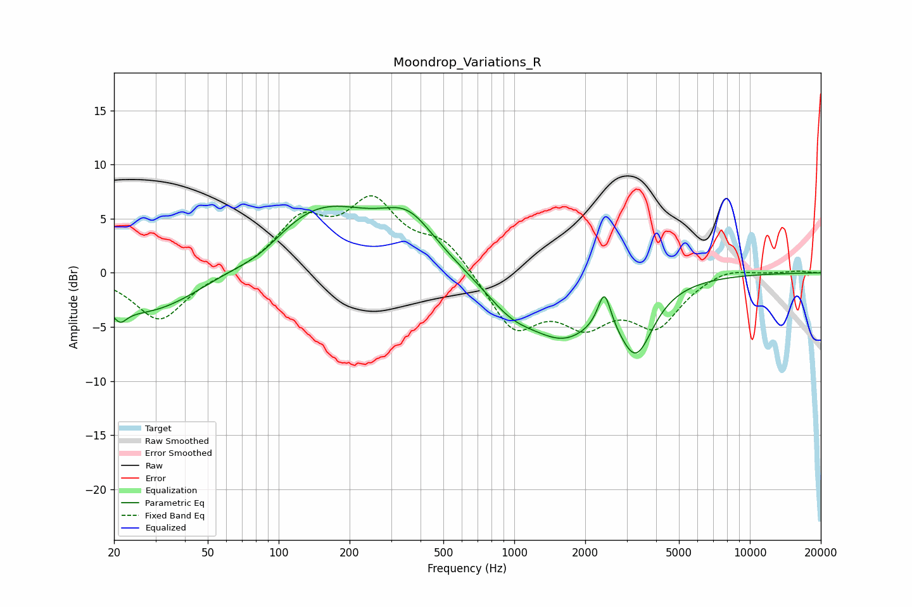

# Moondrop_Variations_R
See [usage instructions](https://github.com/jaakkopasanen/AutoEq#usage) for more options and info.

### Parametric EQs
Apply preamp of -6.2 dB when using parametric equalizer.

|   # | Type    |   Fc (Hz) |    Q |   Gain (dB) |
|-----|---------|-----------|------|-------------|
|   1 | Peaking |        21 | 5.64 |        -4.4 |
|   2 | Peaking |        21 | 5.94 |         3.2 |
|   3 | Peaking |        28 | 0.58 |        -4   |
|   4 | Peaking |        83 | 1.31 |        -1.3 |
|   5 | Peaking |       148 | 0.57 |         6.3 |
|   6 | Peaking |       356 | 1.24 |         3.6 |
|   7 | Peaking |       969 | 1.24 |        -2.4 |
|   8 | Peaking |      1626 | 0.94 |        -5   |
|   9 | Peaking |      2412 | 5.22 |         3.4 |
|  10 | Peaking |      3291 | 1.96 |        -6   |

### Fixed Band EQs
When using fixed band (also called graphic) equalizer, apply preamp of **-7.2 dB** (if available) and set gains manually with these parameters.

|   # | Type    |   Fc (Hz) |    Q |   Gain (dB) |
|-----|---------|-----------|------|-------------|
|   1 | Peaking |        31 | 1.41 |        -4.4 |
|   2 | Peaking |        62 | 1.41 |        -0.1 |
|   3 | Peaking |       125 | 1.41 |         4.5 |
|   4 | Peaking |       250 | 1.41 |         6   |
|   5 | Peaking |       500 | 1.41 |         2.8 |
|   6 | Peaking |      1000 | 1.41 |        -5.1 |
|   7 | Peaking |      2000 | 1.41 |        -3.9 |
|   8 | Peaking |      4000 | 1.41 |        -4.5 |
|   9 | Peaking |      8000 | 1.41 |         0.7 |
|  10 | Peaking |     16000 | 1.41 |         0.2 |

### Graphs

