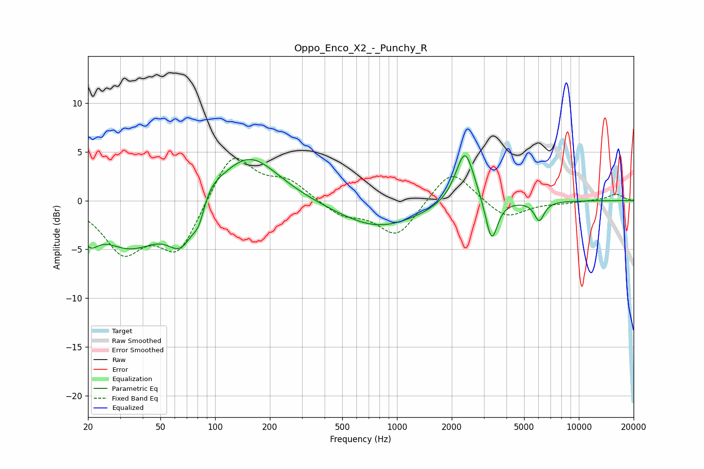

# Oppo_Enco_X2_-_Punchy_R
See [usage instructions](https://github.com/jaakkopasanen/AutoEq#usage) for more options and info.

### Parametric EQs
Apply preamp of -4.7 dB when using parametric equalizer.

|   # | Type    |   Fc (Hz) |    Q |   Gain (dB) |
|-----|---------|-----------|------|-------------|
|   1 | Peaking |        20 | 3.02 |        -2.2 |
|   2 | Peaking |        34 | 0.83 |        -4.6 |
|   3 | Peaking |        65 | 1.89 |        -4.1 |
|   4 | Peaking |        81 | 4.36 |        -2.1 |
|   5 | Peaking |        91 | 2.17 |         1.5 |
|   6 | Peaking |       153 | 0.87 |         5   |
|   7 | Peaking |       788 | 0.63 |        -2.8 |
|   8 | Peaking |      2365 | 2.73 |         5.8 |
|   9 | Peaking |      3313 | 4.31 |        -4.5 |
|  10 | Peaking |      6055 | 5.08 |        -2   |

### Fixed Band EQs
When using fixed band (also called graphic) equalizer, apply preamp of **-4.4 dB** (if available) and set gains manually with these parameters.

|   # | Type    |   Fc (Hz) |    Q |   Gain (dB) |
|-----|---------|-----------|------|-------------|
|   1 | Peaking |        31 | 1.41 |        -4.9 |
|   2 | Peaking |        62 | 1.41 |        -5.2 |
|   3 | Peaking |       125 | 1.41 |         5.1 |
|   4 | Peaking |       250 | 1.41 |         1.9 |
|   5 | Peaking |       500 | 1.41 |        -1.5 |
|   6 | Peaking |      1000 | 1.41 |        -3.7 |
|   7 | Peaking |      2000 | 1.41 |         3.5 |
|   8 | Peaking |      4000 | 1.41 |        -1.9 |
|   9 | Peaking |      8000 | 1.41 |        -0.2 |
|  10 | Peaking |     16000 | 1.41 |         0.7 |

### Graphs

