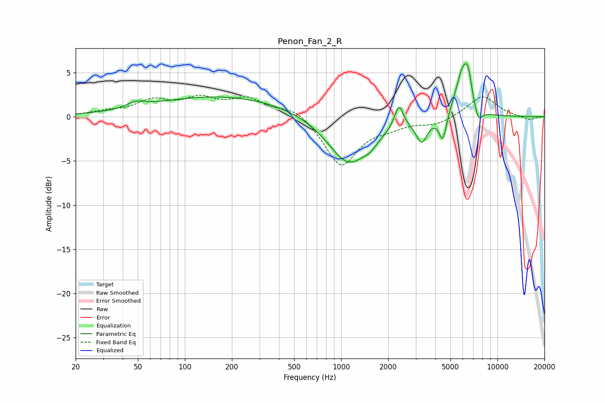

# Penon_Fan_2_R
See [usage instructions](https://github.com/jaakkopasanen/AutoEq#usage) for more options and info.

### Parametric EQs
Apply preamp of -6.1 dB when using parametric equalizer.

|   # | Type    |   Fc (Hz) |    Q |   Gain (dB) |
|-----|---------|-----------|------|-------------|
|   1 | Peaking |        49 | 2.46 |         0.6 |
|   2 | Peaking |       174 | 0.31 |         2.3 |
|   3 | Peaking |      1117 | 1.06 |        -5.5 |
|   4 | Peaking |      1545 | 3.12 |        -0.7 |
|   5 | Peaking |      2342 | 5.14 |         2.6 |
|   6 | Peaking |      3274 | 4    |        -2.6 |
|   7 | Peaking |      4471 | 6    |        -3   |
|   8 | Peaking |      5966 | 3.05 |         5   |
|   9 | Peaking |      6488 | 5.73 |         2.6 |
|  10 | Peaking |      7537 | 5.22 |        -1.6 |

### Fixed Band EQs
When using fixed band (also called graphic) equalizer, apply preamp of **-2.5 dB** (if available) and set gains manually with these parameters.

|   # | Type    |   Fc (Hz) |    Q |   Gain (dB) |
|-----|---------|-----------|------|-------------|
|   1 | Peaking |        31 | 1.41 |         0.4 |
|   2 | Peaking |        62 | 1.41 |         1.6 |
|   3 | Peaking |       125 | 1.41 |         1.8 |
|   4 | Peaking |       250 | 1.41 |         1.8 |
|   5 | Peaking |       500 | 1.41 |         1.1 |
|   6 | Peaking |      1000 | 1.41 |        -5.6 |
|   7 | Peaking |      2000 | 1.41 |        -0.8 |
|   8 | Peaking |      4000 | 1.41 |        -0.8 |
|   9 | Peaking |      8000 | 1.41 |         2.4 |
|  10 | Peaking |     16000 | 1.41 |        -0.4 |

### Graphs

