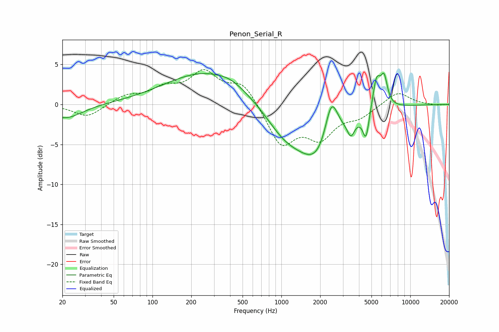

# Penon_Serial_R
See [usage instructions](https://github.com/jaakkopasanen/AutoEq#usage) for more options and info.

### Parametric EQs
Apply preamp of -4.0 dB when using parametric equalizer.

|   # | Type    |   Fc (Hz) |    Q |   Gain (dB) |
|-----|---------|-----------|------|-------------|
|   1 | Peaking |        21 | 1.1  |        -1.8 |
|   2 | Peaking |       271 | 0.43 |         4.2 |
|   3 | Peaking |       405 | 1.78 |         0.4 |
|   4 | Peaking |      1057 | 0.9  |        -3.2 |
|   5 | Peaking |      1986 | 0.9  |        -6.8 |
|   6 | Peaking |      2443 | 2.62 |         6.2 |
|   7 | Peaking |      3461 | 5.05 |        -1.9 |
|   8 | Peaking |      4530 | 5.81 |        -3.4 |
|   9 | Peaking |      5472 | 4.62 |         3.9 |
|  10 | Peaking |      6258 | 5.18 |         3.5 |

### Fixed Band EQs
When using fixed band (also called graphic) equalizer, apply preamp of **-4.5 dB** (if available) and set gains manually with these parameters.

|   # | Type    |   Fc (Hz) |    Q |   Gain (dB) |
|-----|---------|-----------|------|-------------|
|   1 | Peaking |        31 | 1.41 |        -1.6 |
|   2 | Peaking |        62 | 1.41 |         1   |
|   3 | Peaking |       125 | 1.41 |         1.7 |
|   4 | Peaking |       250 | 1.41 |         3.7 |
|   5 | Peaking |       500 | 1.41 |         2.7 |
|   6 | Peaking |      1000 | 1.41 |        -5   |
|   7 | Peaking |      2000 | 1.41 |        -3.7 |
|   8 | Peaking |      4000 | 1.41 |        -1.3 |
|   9 | Peaking |      8000 | 1.41 |         1.7 |
|  10 | Peaking |     16000 | 1.41 |        -0.1 |

### Graphs

