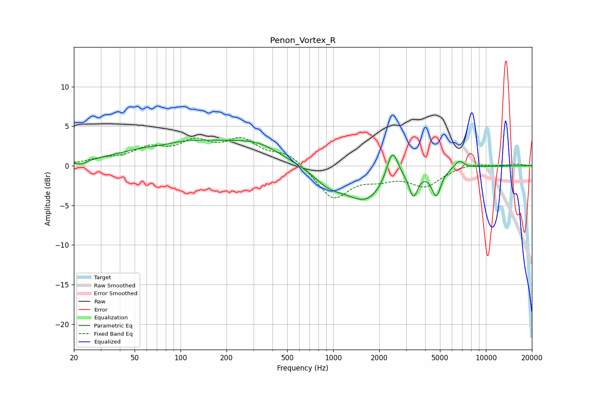

# Penon_Vortex_R
See [usage instructions](https://github.com/jaakkopasanen/AutoEq#usage) for more options and info.

### Parametric EQs
Apply preamp of -3.4 dB when using parametric equalizer.

|   # | Type    |   Fc (Hz) |    Q |   Gain (dB) |
|-----|---------|-----------|------|-------------|
|   1 | Peaking |        22 | 3.71 |        -0.5 |
|   2 | Peaking |        76 | 1.76 |        -0.2 |
|   3 | Peaking |       113 | 0.37 |         3   |
|   4 | Peaking |       322 | 0.95 |         1.5 |
|   5 | Peaking |       934 | 1.41 |        -1.8 |
|   6 | Peaking |      1644 | 1.04 |        -4.2 |
|   7 | Peaking |      2438 | 3.69 |         4.2 |
|   8 | Peaking |      3349 | 5    |        -3   |
|   9 | Peaking |      4734 | 4.77 |        -3.3 |
|  10 | Peaking |      6685 | 4.58 |         1   |

### Fixed Band EQs
When using fixed band (also called graphic) equalizer, apply preamp of **-3.7 dB** (if available) and set gains manually with these parameters.

|   # | Type    |   Fc (Hz) |    Q |   Gain (dB) |
|-----|---------|-----------|------|-------------|
|   1 | Peaking |        31 | 1.41 |         0.7 |
|   2 | Peaking |        62 | 1.41 |         1.9 |
|   3 | Peaking |       125 | 1.41 |         2.6 |
|   4 | Peaking |       250 | 1.41 |         2.9 |
|   5 | Peaking |       500 | 1.41 |         1.6 |
|   6 | Peaking |      1000 | 1.41 |        -4.2 |
|   7 | Peaking |      2000 | 1.41 |        -1.2 |
|   8 | Peaking |      4000 | 1.41 |        -2.4 |
|   9 | Peaking |      8000 | 1.41 |         0.4 |
|  10 | Peaking |     16000 | 1.41 |         0.2 |

### Graphs

