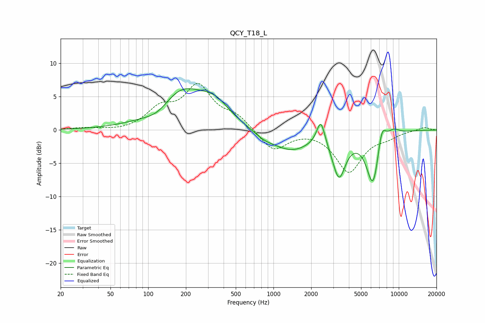

# QCY_T18_L
See [usage instructions](https://github.com/jaakkopasanen/AutoEq#usage) for more options and info.

### Parametric EQs
Apply preamp of -6.3 dB when using parametric equalizer.

|   # | Type    |   Fc (Hz) |    Q |   Gain (dB) |
|-----|---------|-----------|------|-------------|
|   1 | Peaking |       120 | 1.31 |        -1.7 |
|   2 | Peaking |       182 | 0.73 |         6.1 |
|   3 | Peaking |       343 | 1.24 |         2.5 |
|   4 | Peaking |       843 | 1.66 |        -0.8 |
|   5 | Peaking |      1388 | 0.91 |        -2.9 |
|   6 | Peaking |      2386 | 4.3  |         3.8 |
|   7 | Peaking |      3332 | 2.71 |        -6.3 |
|   8 | Peaking |      6240 | 2.6  |        -8.3 |
|   9 | Peaking |      7310 | 3.95 |         3.7 |
|  10 | Peaking |      9070 | 2.73 |         0.9 |

### Fixed Band EQs
When using fixed band (also called graphic) equalizer, apply preamp of **-7.1 dB** (if available) and set gains manually with these parameters.

|   # | Type    |   Fc (Hz) |    Q |   Gain (dB) |
|-----|---------|-----------|------|-------------|
|   1 | Peaking |        31 | 1.41 |         0.3 |
|   2 | Peaking |        62 | 1.41 |        -0.2 |
|   3 | Peaking |       125 | 1.41 |         2.9 |
|   4 | Peaking |       250 | 1.41 |         6.3 |
|   5 | Peaking |       500 | 1.41 |         1.9 |
|   6 | Peaking |      1000 | 1.41 |        -3.2 |
|   7 | Peaking |      2000 | 1.41 |         0.1 |
|   8 | Peaking |      4000 | 1.41 |        -6.2 |
|   9 | Peaking |      8000 | 1.41 |        -0.8 |
|  10 | Peaking |     16000 | 1.41 |         0.5 |

### Graphs

