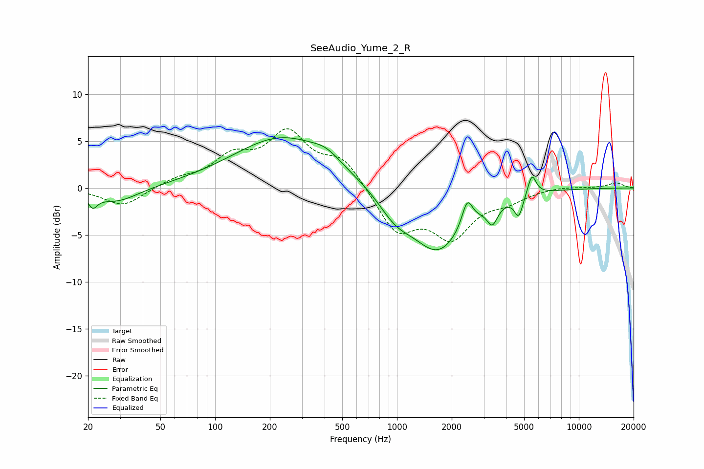

# SeeAudio_Yume_2_R
See [usage instructions](https://github.com/jaakkopasanen/AutoEq#usage) for more options and info.

### Parametric EQs
Apply preamp of -5.4 dB when using parametric equalizer.

|   # | Type    |   Fc (Hz) |    Q |   Gain (dB) |
|-----|---------|-----------|------|-------------|
|   1 | Peaking |        21 | 5.74 |        -1.3 |
|   2 | Peaking |        29 | 1.17 |        -1.6 |
|   3 | Peaking |       235 | 0.52 |         5.4 |
|   4 | Peaking |       408 | 1.84 |         1   |
|   5 | Peaking |       978 | 1.52 |        -2.2 |
|   6 | Peaking |      1683 | 0.96 |        -6.6 |
|   7 | Peaking |      2434 | 4.93 |         2.8 |
|   8 | Peaking |      3344 | 4.92 |        -2   |
|   9 | Peaking |      4671 | 6    |        -2.2 |
|  10 | Peaking |      5520 | 6    |         2.2 |

### Fixed Band EQs
When using fixed band (also called graphic) equalizer, apply preamp of **-6.4 dB** (if available) and set gains manually with these parameters.

|   # | Type    |   Fc (Hz) |    Q |   Gain (dB) |
|-----|---------|-----------|------|-------------|
|   1 | Peaking |        31 | 1.41 |        -2   |
|   2 | Peaking |        62 | 1.41 |         0.8 |
|   3 | Peaking |       125 | 1.41 |         2.9 |
|   4 | Peaking |       250 | 1.41 |         5.4 |
|   5 | Peaking |       500 | 1.41 |         3   |
|   6 | Peaking |      1000 | 1.41 |        -4.6 |
|   7 | Peaking |      2000 | 1.41 |        -4.8 |
|   8 | Peaking |      4000 | 1.41 |        -1.1 |
|   9 | Peaking |      8000 | 1.41 |         0.2 |
|  10 | Peaking |     16000 | 1.41 |         0.5 |

### Graphs

