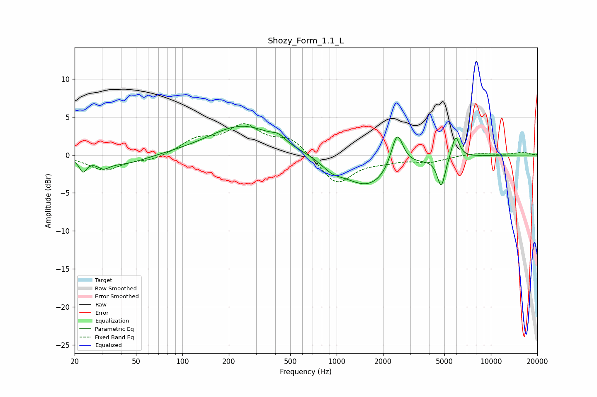

# Shozy_Form_1.1_L
See [usage instructions](https://github.com/jaakkopasanen/AutoEq#usage) for more options and info.

### Parametric EQs
Apply preamp of -3.9 dB when using parametric equalizer.

|   # | Type    |   Fc (Hz) |    Q |   Gain (dB) |
|-----|---------|-----------|------|-------------|
|   1 | Peaking |        23 | 5.97 |        -1.7 |
|   2 | Peaking |        31 | 3.68 |        -0.9 |
|   3 | Peaking |        42 | 0.92 |        -1.3 |
|   4 | Peaking |       246 | 0.65 |         3.9 |
|   5 | Peaking |       420 | 3.47 |         0.7 |
|   6 | Peaking |       934 | 2.11 |        -1.1 |
|   7 | Peaking |      1605 | 0.86 |        -4.2 |
|   8 | Peaking |      2468 | 3.6  |         5   |
|   9 | Peaking |      4769 | 5.44 |        -3.9 |
|  10 | Peaking |      5900 | 5.45 |         3   |

### Fixed Band EQs
When using fixed band (also called graphic) equalizer, apply preamp of **-4.2 dB** (if available) and set gains manually with these parameters.

|   # | Type    |   Fc (Hz) |    Q |   Gain (dB) |
|-----|---------|-----------|------|-------------|
|   1 | Peaking |        31 | 1.41 |        -2   |
|   2 | Peaking |        62 | 1.41 |        -0.7 |
|   3 | Peaking |       125 | 1.41 |         1.9 |
|   4 | Peaking |       250 | 1.41 |         3.6 |
|   5 | Peaking |       500 | 1.41 |         2.1 |
|   6 | Peaking |      1000 | 1.41 |        -3.9 |
|   7 | Peaking |      2000 | 1.41 |        -0.6 |
|   8 | Peaking |      4000 | 1.41 |        -0.8 |
|   9 | Peaking |      8000 | 1.41 |         0.3 |
|  10 | Peaking |     16000 | 1.41 |         0.4 |

### Graphs

