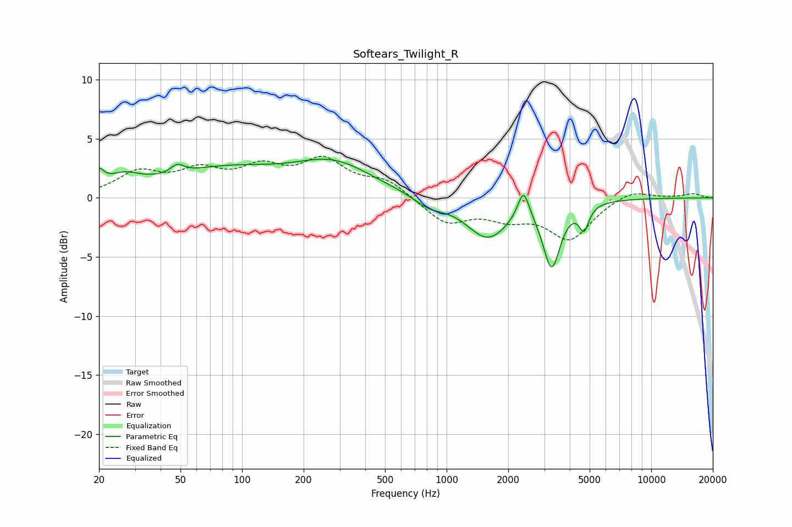

# Softears_Twilight_R
See [usage instructions](https://github.com/jaakkopasanen/AutoEq#usage) for more options and info.

### Parametric EQs
Apply preamp of -3.4 dB when using parametric equalizer.

|   # | Type    |   Fc (Hz) |    Q |   Gain (dB) |
|-----|---------|-----------|------|-------------|
|   1 | Peaking |        20 | 5.86 |         1.3 |
|   2 | Peaking |        26 | 1.63 |         1.3 |
|   3 | Peaking |        48 | 4.35 |         0.8 |
|   4 | Peaking |        82 | 0.51 |         2.2 |
|   5 | Peaking |       281 | 0.74 |         2.7 |
|   6 | Peaking |       822 | 1.89 |        -0.8 |
|   7 | Peaking |      1585 | 1.36 |        -3.3 |
|   8 | Peaking |      2376 | 5    |         2.6 |
|   9 | Peaking |      3263 | 3.39 |        -5.4 |
|  10 | Peaking |      4696 | 6    |        -2   |

### Fixed Band EQs
When using fixed band (also called graphic) equalizer, apply preamp of **-3.6 dB** (if available) and set gains manually with these parameters.

|   # | Type    |   Fc (Hz) |    Q |   Gain (dB) |
|-----|---------|-----------|------|-------------|
|   1 | Peaking |        31 | 1.41 |         2   |
|   2 | Peaking |        62 | 1.41 |         1.9 |
|   3 | Peaking |       125 | 1.41 |         2.1 |
|   4 | Peaking |       250 | 1.41 |         2.9 |
|   5 | Peaking |       500 | 1.41 |         1.4 |
|   6 | Peaking |      1000 | 1.41 |        -2.1 |
|   7 | Peaking |      2000 | 1.41 |        -1.4 |
|   8 | Peaking |      4000 | 1.41 |        -3.4 |
|   9 | Peaking |      8000 | 1.41 |         0.8 |
|  10 | Peaking |     16000 | 1.41 |         0.3 |

### Graphs

