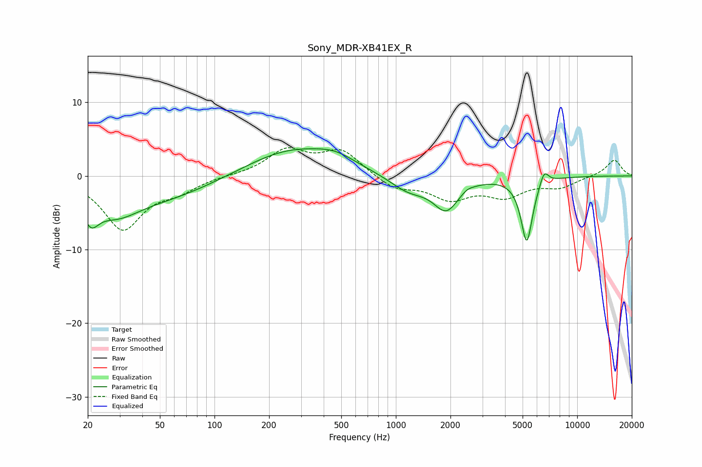

# Sony_MDR-XB41EX_R
See [usage instructions](https://github.com/jaakkopasanen/AutoEq#usage) for more options and info.

### Parametric EQs
Apply preamp of -3.8 dB when using parametric equalizer.

|   # | Type    |   Fc (Hz) |    Q |   Gain (dB) |
|-----|---------|-----------|------|-------------|
|   1 | Peaking |        21 | 3.29 |        -3.4 |
|   2 | Peaking |        28 | 1.08 |        -3.5 |
|   3 | Peaking |        53 | 0.48 |        -2.8 |
|   4 | Peaking |       269 | 0.55 |         3.8 |
|   5 | Peaking |       464 | 1.39 |         1.1 |
|   6 | Peaking |      1176 | 1.31 |        -2.1 |
|   7 | Peaking |      1895 | 2.03 |        -4.2 |
|   8 | Peaking |      2473 | 4.69 |         0.4 |
|   9 | Peaking |      5271 | 4.29 |        -8.8 |
|  10 | Peaking |      6569 | 5.61 |         2   |

### Fixed Band EQs
When using fixed band (also called graphic) equalizer, apply preamp of **-3.9 dB** (if available) and set gains manually with these parameters.

|   # | Type    |   Fc (Hz) |    Q |   Gain (dB) |
|-----|---------|-----------|------|-------------|
|   1 | Peaking |        31 | 1.41 |        -7.1 |
|   2 | Peaking |        62 | 1.41 |        -1.6 |
|   3 | Peaking |       125 | 1.41 |         0.1 |
|   4 | Peaking |       250 | 1.41 |         3.4 |
|   5 | Peaking |       500 | 1.41 |         3.4 |
|   6 | Peaking |      1000 | 1.41 |        -1.7 |
|   7 | Peaking |      2000 | 1.41 |        -2.9 |
|   8 | Peaking |      4000 | 1.41 |        -2.5 |
|   9 | Peaking |      8000 | 1.41 |        -1.4 |
|  10 | Peaking |     16000 | 1.41 |         2.2 |

### Graphs

