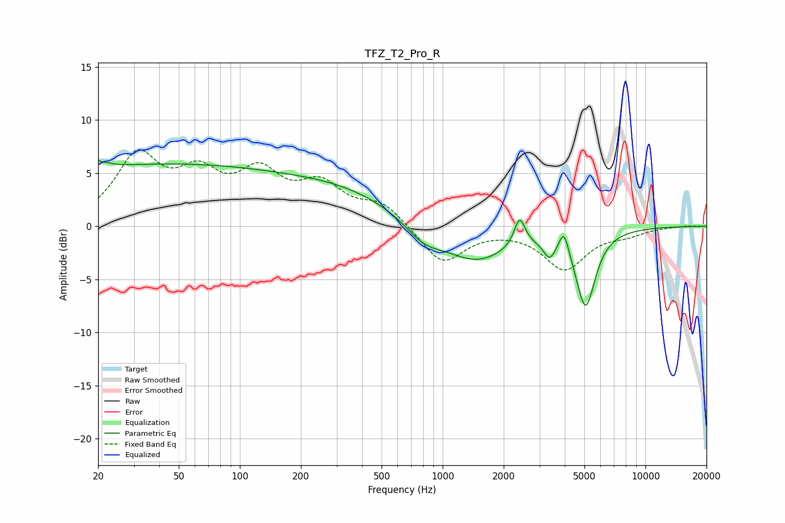

# TFZ_T2_Pro_R
See [usage instructions](https://github.com/jaakkopasanen/AutoEq#usage) for more options and info.

### Parametric EQs
Apply preamp of -6.3 dB when using parametric equalizer.

|   # | Type    |   Fc (Hz) |    Q |   Gain (dB) |
|-----|---------|-----------|------|-------------|
|   1 | Peaking |        20 | 5.06 |         3.7 |
|   2 | Peaking |        20 | 5.97 |        -2.9 |
|   3 | Peaking |        39 | 0.18 |         5.7 |
|   4 | Peaking |       348 | 0.5  |         2.2 |
|   5 | Peaking |       807 | 1.54 |        -1.7 |
|   6 | Peaking |      1460 | 0.86 |        -3.3 |
|   7 | Peaking |      2398 | 5.33 |         2.7 |
|   8 | Peaking |      3366 | 4.69 |        -1.7 |
|   9 | Peaking |      3964 | 6    |         2.2 |
|  10 | Peaking |      5067 | 2.92 |        -7.2 |

### Fixed Band EQs
When using fixed band (also called graphic) equalizer, apply preamp of **-7.3 dB** (if available) and set gains manually with these parameters.

|   # | Type    |   Fc (Hz) |    Q |   Gain (dB) |
|-----|---------|-----------|------|-------------|
|   1 | Peaking |        31 | 1.41 |         6.2 |
|   2 | Peaking |        62 | 1.41 |         4   |
|   3 | Peaking |       125 | 1.41 |         4.3 |
|   4 | Peaking |       250 | 1.41 |         3.4 |
|   5 | Peaking |       500 | 1.41 |         2   |
|   6 | Peaking |      1000 | 1.41 |        -3.6 |
|   7 | Peaking |      2000 | 1.41 |        -0.1 |
|   8 | Peaking |      4000 | 1.41 |        -3.9 |
|   9 | Peaking |      8000 | 1.41 |        -0.6 |
|  10 | Peaking |     16000 | 1.41 |         0.1 |

### Graphs

