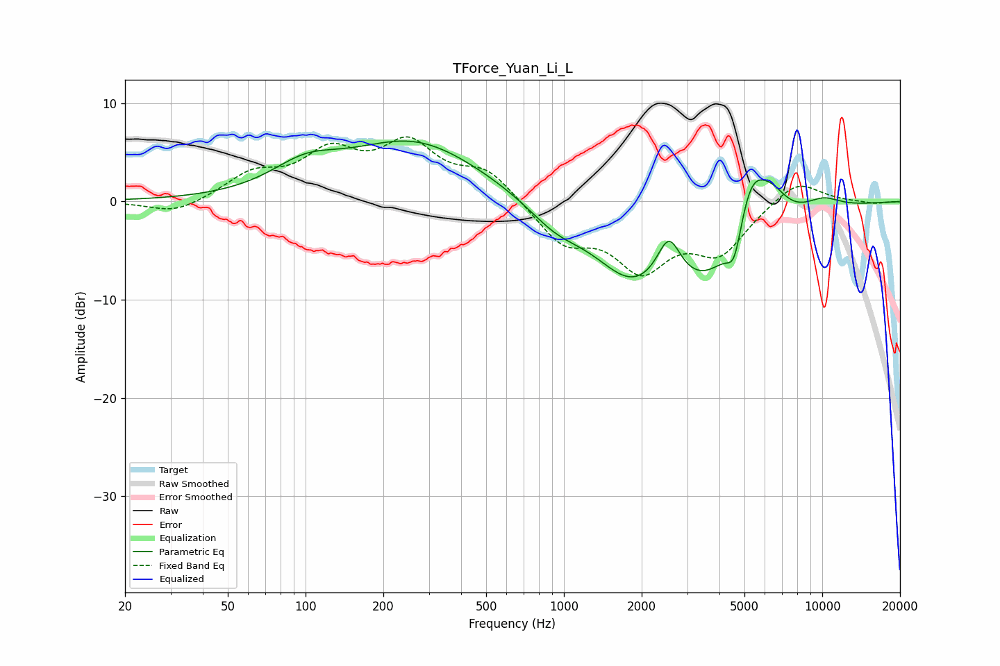

# TForce_Yuan_Li_L
See [usage instructions](https://github.com/jaakkopasanen/AutoEq#usage) for more options and info.

### Parametric EQs
Apply preamp of -6.3 dB when using parametric equalizer.

|   # | Type    |   Fc (Hz) |    Q |   Gain (dB) |
|-----|---------|-----------|------|-------------|
|   1 | Peaking |       100 | 1.08 |         2.5 |
|   2 | Peaking |       265 | 0.54 |         6.1 |
|   3 | Peaking |       927 | 1.29 |        -2.2 |
|   4 | Peaking |      1797 | 1.01 |        -5   |
|   5 | Peaking |      2548 | 3.07 |         4.6 |
|   6 | Peaking |      3754 | 0.67 |        -8.3 |
|   7 | Peaking |      4572 | 4.68 |        -3.7 |
|   8 | Peaking |      5279 | 1.97 |         7.7 |
|   9 | Peaking |      6393 | 2.19 |         2.5 |
|  10 | Peaking |     10000 | 1.63 |         1.4 |

### Fixed Band EQs
When using fixed band (also called graphic) equalizer, apply preamp of **-6.7 dB** (if available) and set gains manually with these parameters.

|   # | Type    |   Fc (Hz) |    Q |   Gain (dB) |
|-----|---------|-----------|------|-------------|
|   1 | Peaking |        31 | 1.41 |        -1.3 |
|   2 | Peaking |        62 | 1.41 |         2.5 |
|   3 | Peaking |       125 | 1.41 |         4.4 |
|   4 | Peaking |       250 | 1.41 |         5.3 |
|   5 | Peaking |       500 | 1.41 |         3   |
|   6 | Peaking |      1000 | 1.41 |        -4   |
|   7 | Peaking |      2000 | 1.41 |        -6.2 |
|   8 | Peaking |      4000 | 1.41 |        -4.8 |
|   9 | Peaking |      8000 | 1.41 |         2.4 |
|  10 | Peaking |     16000 | 1.41 |        -0.2 |

### Graphs

