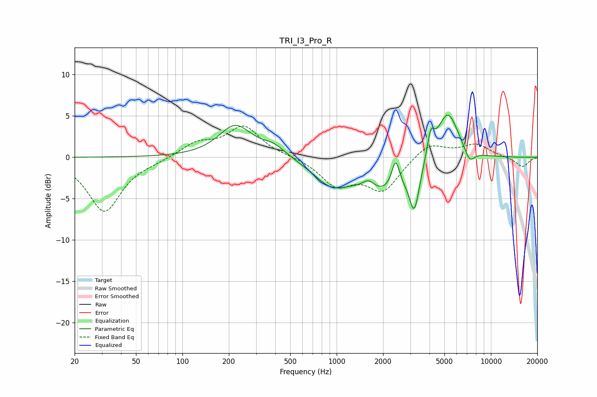

# TRI_I3_Pro_R
See [usage instructions](https://github.com/jaakkopasanen/AutoEq#usage) for more options and info.

### Parametric EQs
Apply preamp of -5.2 dB when using parametric equalizer.

|   # | Type    |   Fc (Hz) |    Q |   Gain (dB) |
|-----|---------|-----------|------|-------------|
|   1 | Peaking |       220 | 1.32 |         3.8 |
|   2 | Peaking |       391 | 1.79 |         1.2 |
|   3 | Peaking |       917 | 1.27 |        -2.6 |
|   4 | Peaking |      1611 | 3.64 |         1.1 |
|   5 | Peaking |      2124 | 0.78 |        -4.2 |
|   6 | Peaking |      2414 | 5.39 |         3.6 |
|   7 | Peaking |      3192 | 4.53 |        -5   |
|   8 | Peaking |      4072 | 5.99 |         3   |
|   9 | Peaking |      5239 | 1.92 |         6.3 |
|  10 | Peaking |      7275 | 4.06 |        -1.6 |

### Fixed Band EQs
When using fixed band (also called graphic) equalizer, apply preamp of **-3.9 dB** (if available) and set gains manually with these parameters.

|   # | Type    |   Fc (Hz) |    Q |   Gain (dB) |
|-----|---------|-----------|------|-------------|
|   1 | Peaking |        31 | 1.41 |        -6.5 |
|   2 | Peaking |        62 | 1.41 |        -0.3 |
|   3 | Peaking |       125 | 1.41 |         1.6 |
|   4 | Peaking |       250 | 1.41 |         3.7 |
|   5 | Peaking |       500 | 1.41 |         0.1 |
|   6 | Peaking |      1000 | 1.41 |        -3.2 |
|   7 | Peaking |      2000 | 1.41 |        -3.9 |
|   8 | Peaking |      4000 | 1.41 |         1.8 |
|   9 | Peaking |      8000 | 1.41 |         1.5 |
|  10 | Peaking |     16000 | 1.41 |        -1.2 |

### Graphs

