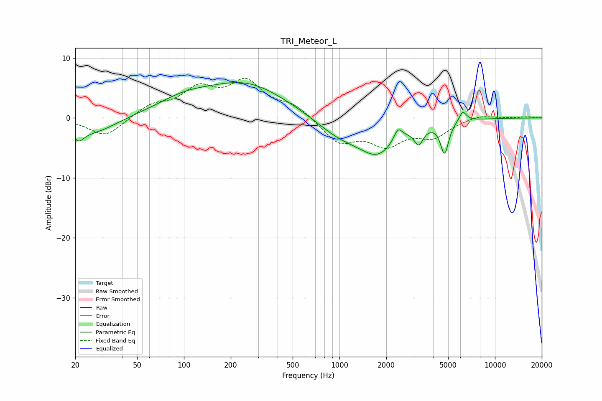

# TRI_Meteor_L
See [usage instructions](https://github.com/jaakkopasanen/AutoEq#usage) for more options and info.

### Parametric EQs
Apply preamp of -6.0 dB when using parametric equalizer.

|   # | Type    |   Fc (Hz) |    Q |   Gain (dB) |
|-----|---------|-----------|------|-------------|
|   1 | Peaking |        21 | 4.09 |        -2   |
|   2 | Peaking |        26 | 0.98 |        -2.6 |
|   3 | Peaking |       100 | 0.77 |         2.3 |
|   4 | Peaking |       254 | 0.54 |         5.5 |
|   5 | Peaking |      1006 | 0.89 |        -2.9 |
|   6 | Peaking |      1766 | 1.19 |        -5.1 |
|   7 | Peaking |      2381 | 5.09 |         2.1 |
|   8 | Peaking |      3236 | 5    |        -2.7 |
|   9 | Peaking |      4741 | 5.39 |        -5.3 |
|  10 | Peaking |      6202 | 5.82 |         1.8 |

### Fixed Band EQs
When using fixed band (also called graphic) equalizer, apply preamp of **-6.7 dB** (if available) and set gains manually with these parameters.

|   # | Type    |   Fc (Hz) |    Q |   Gain (dB) |
|-----|---------|-----------|------|-------------|
|   1 | Peaking |        31 | 1.41 |        -3.2 |
|   2 | Peaking |        62 | 1.41 |         2   |
|   3 | Peaking |       125 | 1.41 |         4.3 |
|   4 | Peaking |       250 | 1.41 |         5.5 |
|   5 | Peaking |       500 | 1.41 |         2   |
|   6 | Peaking |      1000 | 1.41 |        -4   |
|   7 | Peaking |      2000 | 1.41 |        -4   |
|   8 | Peaking |      4000 | 1.41 |        -2.8 |
|   9 | Peaking |      8000 | 1.41 |         0.6 |
|  10 | Peaking |     16000 | 1.41 |         0.2 |

### Graphs

