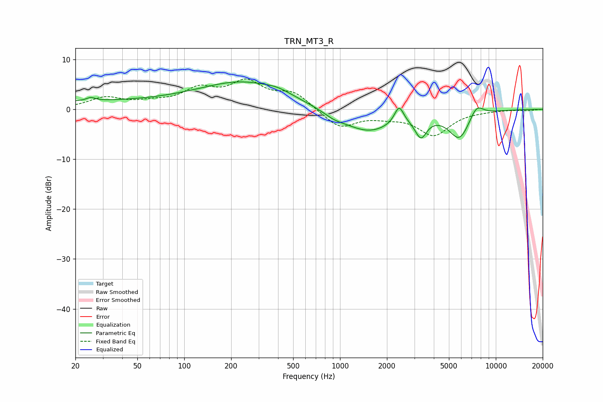

# TRN_MT3_R
See [usage instructions](https://github.com/jaakkopasanen/AutoEq#usage) for more options and info.

### Parametric EQs
Apply preamp of -5.6 dB when using parametric equalizer.

|   # | Type    |   Fc (Hz) |    Q |   Gain (dB) |
|-----|---------|-----------|------|-------------|
|   1 | Peaking |        25 | 0.18 |         1.5 |
|   2 | Peaking |        25 | 5.4  |         0.7 |
|   3 | Peaking |       243 | 0.5  |         5.2 |
|   4 | Peaking |       400 | 1.88 |         0.7 |
|   5 | Peaking |       912 | 2.01 |        -0.9 |
|   6 | Peaking |      1515 | 0.85 |        -4.6 |
|   7 | Peaking |      2394 | 4.75 |         3.6 |
|   8 | Peaking |      3306 | 3.79 |        -4   |
|   9 | Peaking |      5842 | 2.02 |        -5.7 |
|  10 | Peaking |      7517 | 3.04 |         2.6 |

### Fixed Band EQs
When using fixed band (also called graphic) equalizer, apply preamp of **-6.1 dB** (if available) and set gains manually with these parameters.

|   # | Type    |   Fc (Hz) |    Q |   Gain (dB) |
|-----|---------|-----------|------|-------------|
|   1 | Peaking |        31 | 1.41 |         2.2 |
|   2 | Peaking |        62 | 1.41 |         1   |
|   3 | Peaking |       125 | 1.41 |         3.5 |
|   4 | Peaking |       250 | 1.41 |         4.9 |
|   5 | Peaking |       500 | 1.41 |         3.1 |
|   6 | Peaking |      1000 | 1.41 |        -3.8 |
|   7 | Peaking |      2000 | 1.41 |        -1   |
|   8 | Peaking |      4000 | 1.41 |        -5   |
|   9 | Peaking |      8000 | 1.41 |        -0.2 |
|  10 | Peaking |     16000 | 1.41 |        -0.2 |

### Graphs

