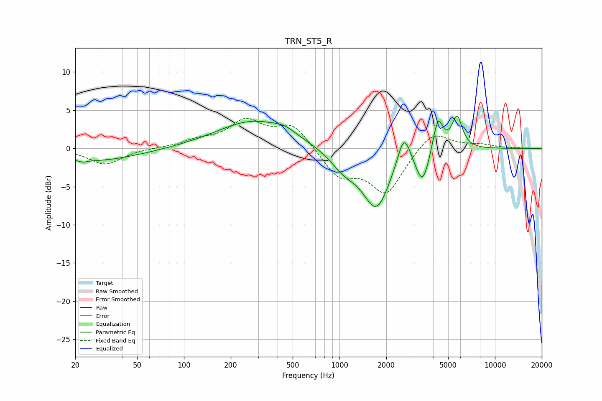

# TRN_ST5_R
See [usage instructions](https://github.com/jaakkopasanen/AutoEq#usage) for more options and info.

### Parametric EQs
Apply preamp of -4.3 dB when using parametric equalizer.

|   # | Type    |   Fc (Hz) |    Q |   Gain (dB) |
|-----|---------|-----------|------|-------------|
|   1 | Peaking |        22 | 5.37 |        -0.3 |
|   2 | Peaking |        27 | 0.5  |        -1.6 |
|   3 | Peaking |       278 | 0.61 |         3.6 |
|   4 | Peaking |       444 | 2.04 |         0.7 |
|   5 | Peaking |      1067 | 1.62 |        -2.1 |
|   6 | Peaking |      1729 | 1.56 |        -7.7 |
|   7 | Peaking |      2599 | 3.36 |         4.4 |
|   8 | Peaking |      3427 | 3.15 |        -4.5 |
|   9 | Peaking |      4296 | 4.13 |         4.7 |
|  10 | Peaking |      5704 | 4.14 |         4.2 |

### Fixed Band EQs
When using fixed band (also called graphic) equalizer, apply preamp of **-4.0 dB** (if available) and set gains manually with these parameters.

|   # | Type    |   Fc (Hz) |    Q |   Gain (dB) |
|-----|---------|-----------|------|-------------|
|   1 | Peaking |        31 | 1.41 |        -2.1 |
|   2 | Peaking |        62 | 1.41 |         0   |
|   3 | Peaking |       125 | 1.41 |         0.9 |
|   4 | Peaking |       250 | 1.41 |         3.4 |
|   5 | Peaking |       500 | 1.41 |         3.1 |
|   6 | Peaking |      1000 | 1.41 |        -3.5 |
|   7 | Peaking |      2000 | 1.41 |        -5.7 |
|   8 | Peaking |      4000 | 1.41 |         2.6 |
|   9 | Peaking |      8000 | 1.41 |         0.4 |
|  10 | Peaking |     16000 | 1.41 |         0   |

### Graphs

