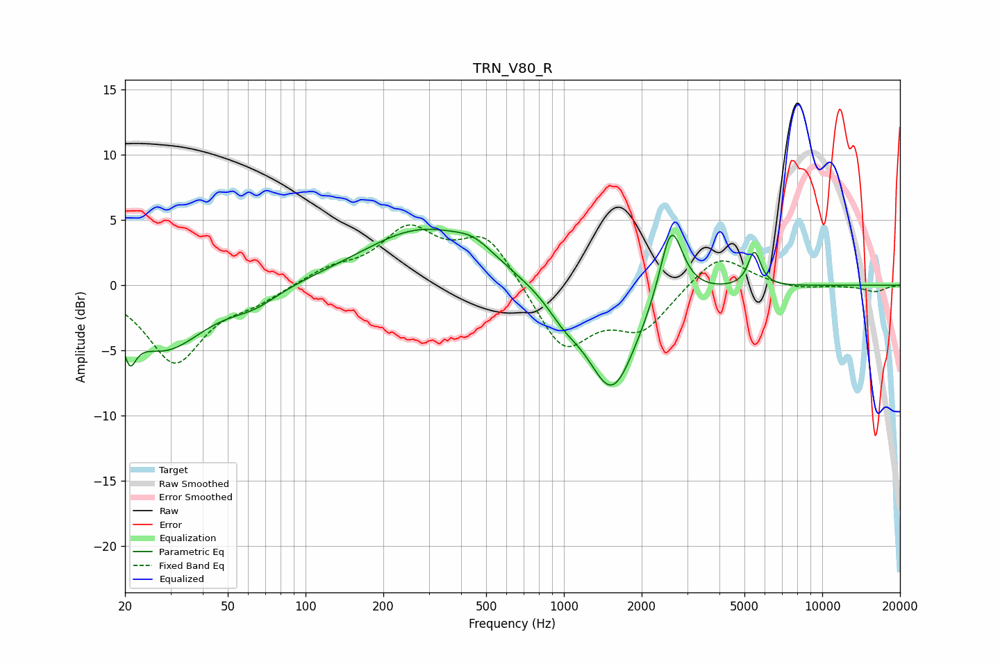

# TRN_V80_R
See [usage instructions](https://github.com/jaakkopasanen/AutoEq#usage) for more options and info.

### Parametric EQs
Apply preamp of -4.4 dB when using parametric equalizer.

|   # | Type    |   Fc (Hz) |    Q |   Gain (dB) |
|-----|---------|-----------|------|-------------|
|   1 | Peaking |        21 | 6    |         3.2 |
|   2 | Peaking |        21 | 5.88 |        -5.8 |
|   3 | Peaking |        28 | 0.9  |        -4.8 |
|   4 | Peaking |        63 | 1.48 |        -1   |
|   5 | Peaking |       282 | 0.61 |         4.3 |
|   6 | Peaking |       449 | 1.9  |         1   |
|   7 | Peaking |      1001 | 2.13 |        -1.3 |
|   8 | Peaking |      1537 | 1.42 |        -8.3 |
|   9 | Peaking |      2601 | 3.15 |         6.1 |
|  10 | Peaking |      5463 | 5.7  |         2.7 |

### Fixed Band EQs
When using fixed band (also called graphic) equalizer, apply preamp of **-4.7 dB** (if available) and set gains manually with these parameters.

|   # | Type    |   Fc (Hz) |    Q |   Gain (dB) |
|-----|---------|-----------|------|-------------|
|   1 | Peaking |        31 | 1.41 |        -5.9 |
|   2 | Peaking |        62 | 1.41 |        -1   |
|   3 | Peaking |       125 | 1.41 |         1.1 |
|   4 | Peaking |       250 | 1.41 |         4   |
|   5 | Peaking |       500 | 1.41 |         3.8 |
|   6 | Peaking |      1000 | 1.41 |        -5   |
|   7 | Peaking |      2000 | 1.41 |        -3.2 |
|   8 | Peaking |      4000 | 1.41 |         2.6 |
|   9 | Peaking |      8000 | 1.41 |        -0.3 |
|  10 | Peaking |     16000 | 1.41 |        -0.5 |

### Graphs

