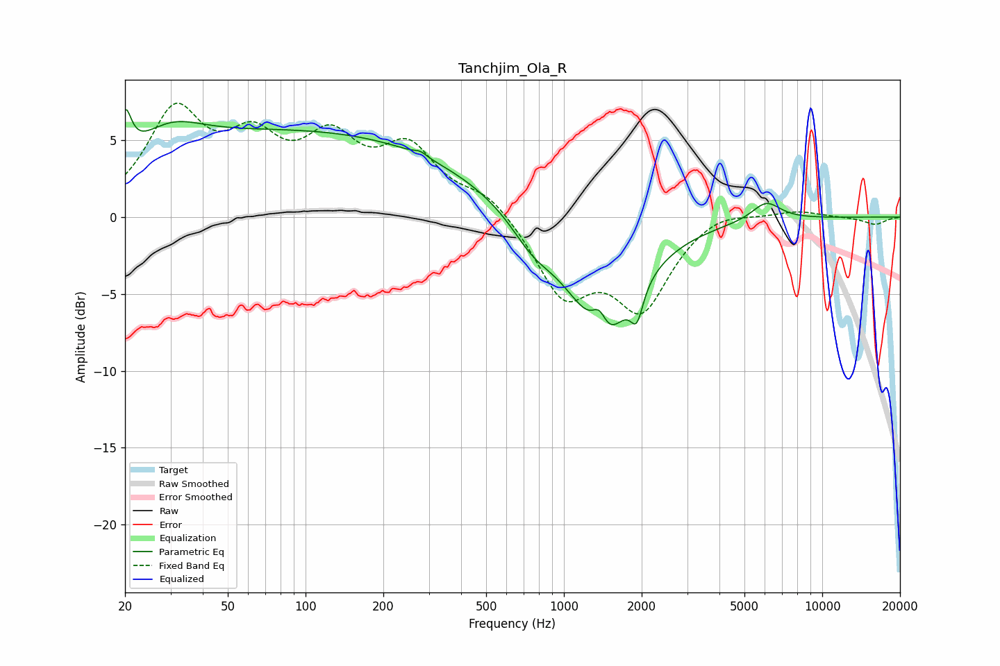

# Tanchjim_Ola_R
See [usage instructions](https://github.com/jaakkopasanen/AutoEq#usage) for more options and info.

### Parametric EQs
Apply preamp of -7.1 dB when using parametric equalizer.

|   # | Type    |   Fc (Hz) |    Q |   Gain (dB) |
|-----|---------|-----------|------|-------------|
|   1 | Peaking |        20 | 6    |         3   |
|   2 | Peaking |        29 | 1.09 |         2.1 |
|   3 | Peaking |       100 | 0.2  |         5.5 |
|   4 | Peaking |       278 | 5.99 |         0.3 |
|   5 | Peaking |       754 | 1.7  |        -1.5 |
|   6 | Peaking |      1371 | 4.93 |         1.6 |
|   7 | Peaking |      1387 | 0.99 |        -7   |
|   8 | Peaking |      1482 | 2.8  |        -1.2 |
|   9 | Peaking |      1916 | 5.9  |        -2.1 |
|  10 | Peaking |      6067 | 2.44 |         1.2 |

### Fixed Band EQs
When using fixed band (also called graphic) equalizer, apply preamp of **-7.5 dB** (if available) and set gains manually with these parameters.

|   # | Type    |   Fc (Hz) |    Q |   Gain (dB) |
|-----|---------|-----------|------|-------------|
|   1 | Peaking |        31 | 1.41 |         6.4 |
|   2 | Peaking |        62 | 1.41 |         4   |
|   3 | Peaking |       125 | 1.41 |         4.3 |
|   4 | Peaking |       250 | 1.41 |         4   |
|   5 | Peaking |       500 | 1.41 |         1.5 |
|   6 | Peaking |      1000 | 1.41 |        -4.9 |
|   7 | Peaking |      2000 | 1.41 |        -5.6 |
|   8 | Peaking |      4000 | 1.41 |         0.7 |
|   9 | Peaking |      8000 | 1.41 |         0.4 |
|  10 | Peaking |     16000 | 1.41 |        -0.5 |

### Graphs

