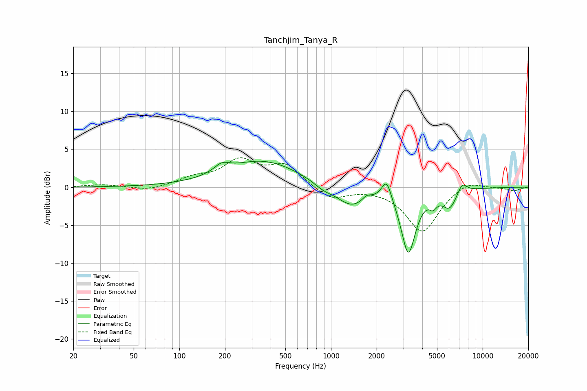

# Tanchjim_Tanya_R
See [usage instructions](https://github.com/jaakkopasanen/AutoEq#usage) for more options and info.

### Parametric EQs
Apply preamp of -3.5 dB when using parametric equalizer.

|   # | Type    |   Fc (Hz) |    Q |   Gain (dB) |
|-----|---------|-----------|------|-------------|
|   1 | Peaking |       191 | 2.75 |         1.1 |
|   2 | Peaking |       355 | 0.59 |         3.5 |
|   3 | Peaking |       887 | 2.24 |        -0.7 |
|   4 | Peaking |      1362 | 1.42 |        -2.6 |
|   5 | Peaking |      1717 | 5.09 |         0.6 |
|   6 | Peaking |      2327 | 4.45 |         2.7 |
|   7 | Peaking |      3236 | 2.93 |        -8.5 |
|   8 | Peaking |      4710 | 6    |        -1.1 |
|   9 | Peaking |      6053 | 2.82 |        -2.4 |
|  10 | Peaking |      7319 | 4.32 |         1.4 |

### Fixed Band EQs
When using fixed band (also called graphic) equalizer, apply preamp of **-4.0 dB** (if available) and set gains manually with these parameters.

|   # | Type    |   Fc (Hz) |    Q |   Gain (dB) |
|-----|---------|-----------|------|-------------|
|   1 | Peaking |        31 | 1.41 |         0.3 |
|   2 | Peaking |        62 | 1.41 |        -0.5 |
|   3 | Peaking |       125 | 1.41 |         1.1 |
|   4 | Peaking |       250 | 1.41 |         3.3 |
|   5 | Peaking |       500 | 1.41 |         2.8 |
|   6 | Peaking |      1000 | 1.41 |        -1.7 |
|   7 | Peaking |      2000 | 1.41 |        -0   |
|   8 | Peaking |      4000 | 1.41 |        -5.9 |
|   9 | Peaking |      8000 | 1.41 |         1.1 |
|  10 | Peaking |     16000 | 1.41 |        -0.5 |

### Graphs

