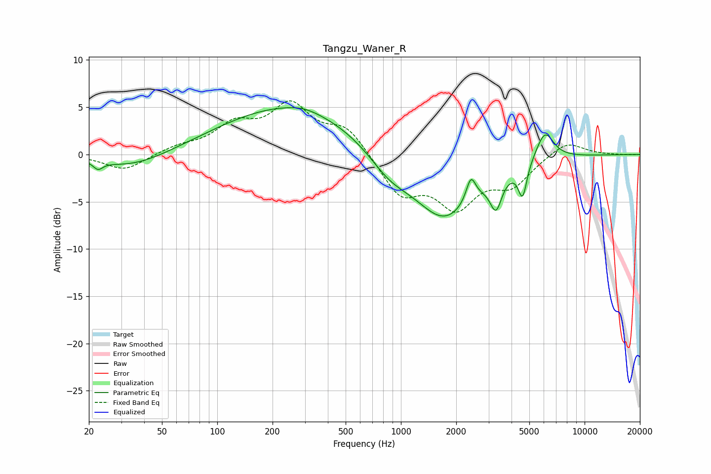

# Tangzu_Waner_R
See [usage instructions](https://github.com/jaakkopasanen/AutoEq#usage) for more options and info.

### Parametric EQs
Apply preamp of -5.1 dB when using parametric equalizer.

|   # | Type    |   Fc (Hz) |    Q |   Gain (dB) |
|-----|---------|-----------|------|-------------|
|   1 | Peaking |        22 | 5.67 |        -0.8 |
|   2 | Peaking |        35 | 0.73 |        -1.6 |
|   3 | Peaking |       248 | 0.37 |         5.1 |
|   4 | Peaking |       295 | 1.68 |         0.3 |
|   5 | Peaking |       863 | 1.24 |        -2.1 |
|   6 | Peaking |      1725 | 0.83 |        -6.9 |
|   7 | Peaking |      2405 | 5.45 |         2.6 |
|   8 | Peaking |      3292 | 4.46 |        -3.3 |
|   9 | Peaking |      4596 | 5.99 |        -3.5 |
|  10 | Peaking |      6076 | 2.84 |         3.1 |

### Fixed Band EQs
When using fixed band (also called graphic) equalizer, apply preamp of **-5.8 dB** (if available) and set gains manually with these parameters.

|   # | Type    |   Fc (Hz) |    Q |   Gain (dB) |
|-----|---------|-----------|------|-------------|
|   1 | Peaking |        31 | 1.41 |        -1.7 |
|   2 | Peaking |        62 | 1.41 |         0.7 |
|   3 | Peaking |       125 | 1.41 |         2.8 |
|   4 | Peaking |       250 | 1.41 |         4.8 |
|   5 | Peaking |       500 | 1.41 |         2.8 |
|   6 | Peaking |      1000 | 1.41 |        -4.1 |
|   7 | Peaking |      2000 | 1.41 |        -5   |
|   8 | Peaking |      4000 | 1.41 |        -2.9 |
|   9 | Peaking |      8000 | 1.41 |         1.5 |
|  10 | Peaking |     16000 | 1.41 |        -0   |

### Graphs

