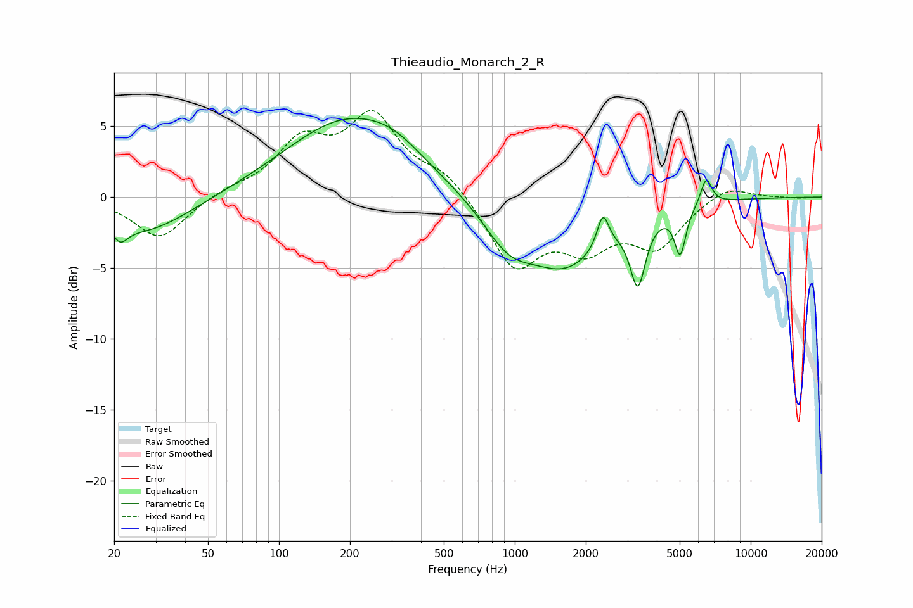

# Thieaudio_Monarch_2_R
See [usage instructions](https://github.com/jaakkopasanen/AutoEq#usage) for more options and info.

### Parametric EQs
Apply preamp of -5.6 dB when using parametric equalizer.

|   # | Type    |   Fc (Hz) |    Q |   Gain (dB) |
|-----|---------|-----------|------|-------------|
|   1 | Peaking |        21 | 4.83 |        -1   |
|   2 | Peaking |        27 | 0.71 |        -2.6 |
|   3 | Peaking |       195 | 0.54 |         5.4 |
|   4 | Peaking |       308 | 1.23 |         0.9 |
|   5 | Peaking |       937 | 1.29 |        -2.7 |
|   6 | Peaking |      1652 | 0.85 |        -4.5 |
|   7 | Peaking |      2363 | 5.76 |         2.4 |
|   8 | Peaking |      3324 | 4.4  |        -4.6 |
|   9 | Peaking |      5026 | 6    |        -3.3 |
|  10 | Peaking |      6476 | 5.84 |         1.9 |

### Fixed Band EQs
When using fixed band (also called graphic) equalizer, apply preamp of **-6.2 dB** (if available) and set gains manually with these parameters.

|   # | Type    |   Fc (Hz) |    Q |   Gain (dB) |
|-----|---------|-----------|------|-------------|
|   1 | Peaking |        31 | 1.41 |        -3   |
|   2 | Peaking |        62 | 1.41 |         0.5 |
|   3 | Peaking |       125 | 1.41 |         3.6 |
|   4 | Peaking |       250 | 1.41 |         5.4 |
|   5 | Peaking |       500 | 1.41 |         1.6 |
|   6 | Peaking |      1000 | 1.41 |        -4.9 |
|   7 | Peaking |      2000 | 1.41 |        -3   |
|   8 | Peaking |      4000 | 1.41 |        -3.3 |
|   9 | Peaking |      8000 | 1.41 |         1   |
|  10 | Peaking |     16000 | 1.41 |        -0.1 |

### Graphs

