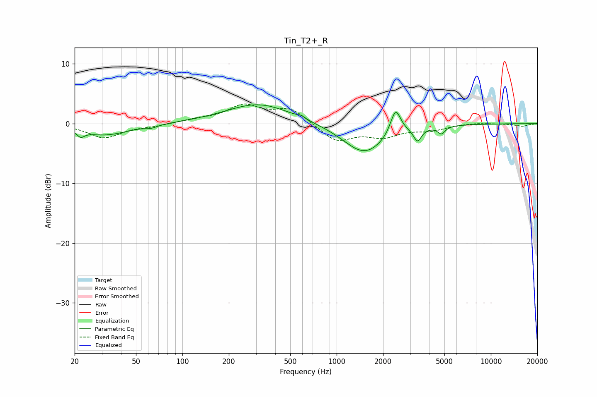

# Tin_T2+_R
See [usage instructions](https://github.com/jaakkopasanen/AutoEq#usage) for more options and info.

### Parametric EQs
Apply preamp of -3.2 dB when using parametric equalizer.

|   # | Type    |   Fc (Hz) |    Q |   Gain (dB) |
|-----|---------|-----------|------|-------------|
|   1 | Peaking |        22 | 5.99 |         1.3 |
|   2 | Peaking |        22 | 5.93 |        -2.3 |
|   3 | Peaking |        31 | 0.92 |        -1.9 |
|   4 | Peaking |        63 | 3.78 |        -0.4 |
|   5 | Peaking |       313 | 0.67 |         3.4 |
|   6 | Peaking |       590 | 6    |         0.4 |
|   7 | Peaking |      1517 | 1.02 |        -5.1 |
|   8 | Peaking |      2411 | 4.17 |         4.5 |
|   9 | Peaking |      3346 | 5.64 |        -2.2 |
|  10 | Peaking |      4782 | 6    |        -1.2 |

### Fixed Band EQs
When using fixed band (also called graphic) equalizer, apply preamp of **-3.4 dB** (if available) and set gains manually with these parameters.

|   # | Type    |   Fc (Hz) |    Q |   Gain (dB) |
|-----|---------|-----------|------|-------------|
|   1 | Peaking |        31 | 1.41 |        -2.4 |
|   2 | Peaking |        62 | 1.41 |        -0.4 |
|   3 | Peaking |       125 | 1.41 |         0.6 |
|   4 | Peaking |       250 | 1.41 |         2.9 |
|   5 | Peaking |       500 | 1.41 |         2.5 |
|   6 | Peaking |      1000 | 1.41 |        -2.9 |
|   7 | Peaking |      2000 | 1.41 |        -1.9 |
|   8 | Peaking |      4000 | 1.41 |        -1   |
|   9 | Peaking |      8000 | 1.41 |         0.2 |
|  10 | Peaking |     16000 | 1.41 |        -0.4 |

### Graphs

