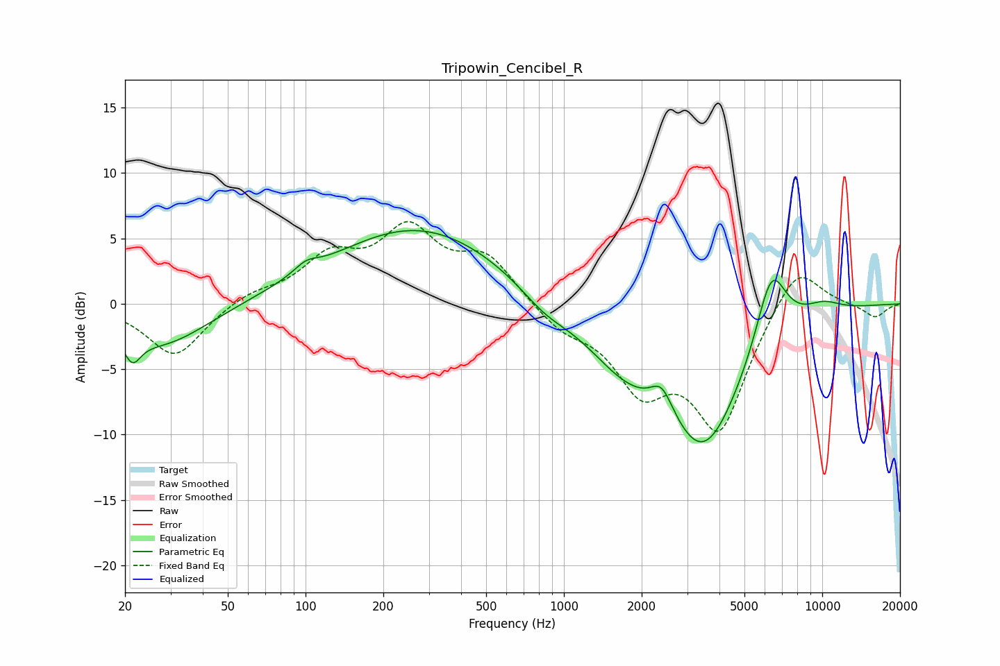

# Tripowin_Cencibel_R
See [usage instructions](https://github.com/jaakkopasanen/AutoEq#usage) for more options and info.

### Parametric EQs
Apply preamp of -5.7 dB when using parametric equalizer.

|   # | Type    |   Fc (Hz) |    Q |   Gain (dB) |
|-----|---------|-----------|------|-------------|
|   1 | Peaking |        21 | 4.42 |        -1.9 |
|   2 | Peaking |        28 | 0.77 |        -3.3 |
|   3 | Peaking |       100 | 3.06 |         0.7 |
|   4 | Peaking |       274 | 0.41 |         5.9 |
|   5 | Peaking |       839 | 1.44 |        -1.3 |
|   6 | Peaking |      1698 | 0.9  |        -3.1 |
|   7 | Peaking |      2391 | 3.2  |         2.2 |
|   8 | Peaking |      3485 | 0.86 |       -10.6 |
|   9 | Peaking |      6350 | 2.24 |         6.1 |
|  10 | Peaking |     10000 | 1.62 |         1   |

### Fixed Band EQs
When using fixed band (also called graphic) equalizer, apply preamp of **-6.4 dB** (if available) and set gains manually with these parameters.

|   # | Type    |   Fc (Hz) |    Q |   Gain (dB) |
|-----|---------|-----------|------|-------------|
|   1 | Peaking |        31 | 1.41 |        -4.1 |
|   2 | Peaking |        62 | 1.41 |         0.8 |
|   3 | Peaking |       125 | 1.41 |         3.2 |
|   4 | Peaking |       250 | 1.41 |         5.2 |
|   5 | Peaking |       500 | 1.41 |         3.3 |
|   6 | Peaking |      1000 | 1.41 |        -1.7 |
|   7 | Peaking |      2000 | 1.41 |        -5.7 |
|   8 | Peaking |      4000 | 1.41 |        -9.2 |
|   9 | Peaking |      8000 | 1.41 |         3.6 |
|  10 | Peaking |     16000 | 1.41 |        -1.1 |

### Graphs

