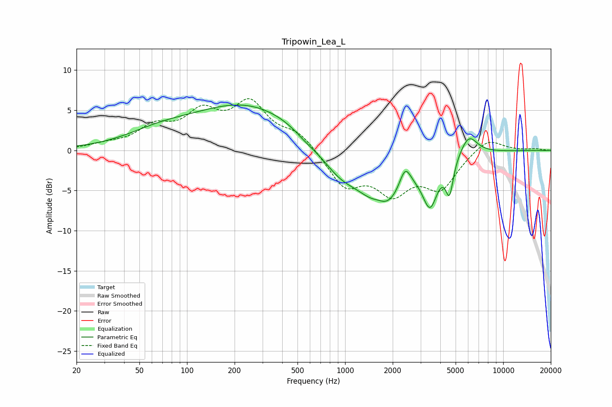

# Tripowin_Lea_L
See [usage instructions](https://github.com/jaakkopasanen/AutoEq#usage) for more options and info.

### Parametric EQs
Apply preamp of -5.7 dB when using parametric equalizer.

|   # | Type    |   Fc (Hz) |    Q |   Gain (dB) |
|-----|---------|-----------|------|-------------|
|   1 | Peaking |        65 | 0.68 |         1.4 |
|   2 | Peaking |       243 | 0.39 |         5.7 |
|   3 | Peaking |       567 | 1.86 |        -0.6 |
|   4 | Peaking |       918 | 1.15 |        -2.9 |
|   5 | Peaking |      1629 | 2.91 |         0.9 |
|   6 | Peaking |      1741 | 1.01 |        -7.1 |
|   7 | Peaking |      2397 | 3.8  |         2.9 |
|   8 | Peaking |      3448 | 3    |        -5.2 |
|   9 | Peaking |      4575 | 5.91 |        -4.1 |
|  10 | Peaking |      6050 | 2.52 |         2.6 |

### Fixed Band EQs
When using fixed band (also called graphic) equalizer, apply preamp of **-6.5 dB** (if available) and set gains manually with these parameters.

|   # | Type    |   Fc (Hz) |    Q |   Gain (dB) |
|-----|---------|-----------|------|-------------|
|   1 | Peaking |        31 | 1.41 |         0.6 |
|   2 | Peaking |        62 | 1.41 |         2.5 |
|   3 | Peaking |       125 | 1.41 |         4.1 |
|   4 | Peaking |       250 | 1.41 |         5.4 |
|   5 | Peaking |       500 | 1.41 |         2   |
|   6 | Peaking |      1000 | 1.41 |        -4.3 |
|   7 | Peaking |      2000 | 1.41 |        -4.6 |
|   8 | Peaking |      4000 | 1.41 |        -4.4 |
|   9 | Peaking |      8000 | 1.41 |         1.7 |
|  10 | Peaking |     16000 | 1.41 |         0.2 |

### Graphs

