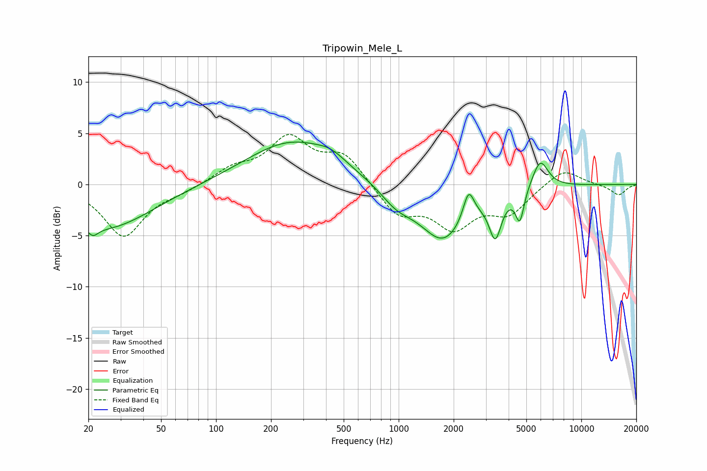

# Tripowin_Mele_L
See [usage instructions](https://github.com/jaakkopasanen/AutoEq#usage) for more options and info.

### Parametric EQs
Apply preamp of -4.2 dB when using parametric equalizer.

|   # | Type    |   Fc (Hz) |    Q |   Gain (dB) |
|-----|---------|-----------|------|-------------|
|   1 | Peaking |        21 | 5    |        -0.9 |
|   2 | Peaking |        25 | 0.56 |        -4.3 |
|   3 | Peaking |       260 | 0.57 |         4.2 |
|   4 | Peaking |       426 | 1.81 |         0.8 |
|   5 | Peaking |       976 | 1.56 |        -1.6 |
|   6 | Peaking |      1754 | 1.1  |        -5.4 |
|   7 | Peaking |      2415 | 4.77 |         2.9 |
|   8 | Peaking |      3380 | 4.26 |        -4   |
|   9 | Peaking |      4607 | 5.99 |        -3.1 |
|  10 | Peaking |      5954 | 3.16 |         2.8 |

### Fixed Band EQs
When using fixed band (also called graphic) equalizer, apply preamp of **-5.0 dB** (if available) and set gains manually with these parameters.

|   # | Type    |   Fc (Hz) |    Q |   Gain (dB) |
|-----|---------|-----------|------|-------------|
|   1 | Peaking |        31 | 1.41 |        -5   |
|   2 | Peaking |        62 | 1.41 |        -0.6 |
|   3 | Peaking |       125 | 1.41 |         1.4 |
|   4 | Peaking |       250 | 1.41 |         4.3 |
|   5 | Peaking |       500 | 1.41 |         2.8 |
|   6 | Peaking |      1000 | 1.41 |        -2.9 |
|   7 | Peaking |      2000 | 1.41 |        -3.8 |
|   8 | Peaking |      4000 | 1.41 |        -2.6 |
|   9 | Peaking |      8000 | 1.41 |         1.7 |
|  10 | Peaking |     16000 | 1.41 |        -1   |

### Graphs

