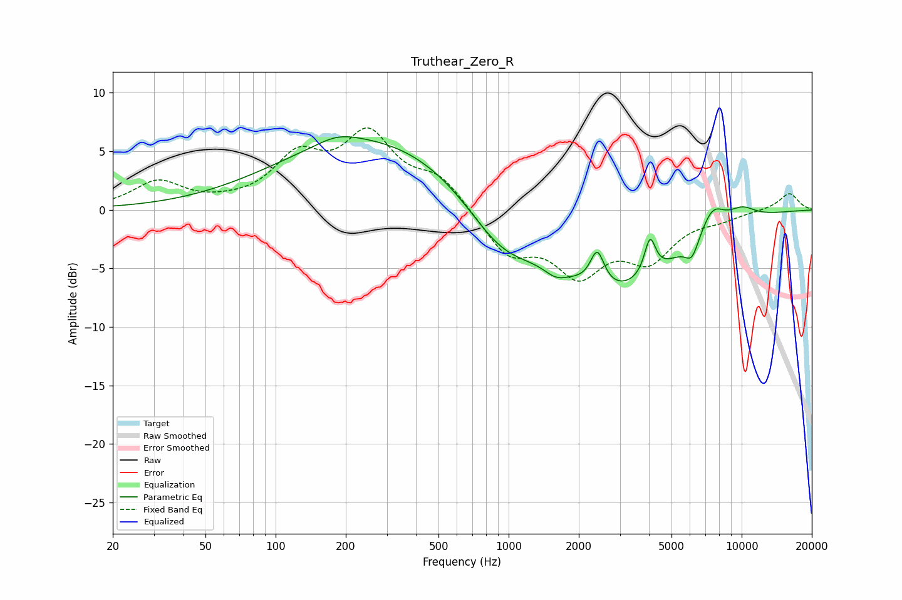

# Truthear_Zero_R
See [usage instructions](https://github.com/jaakkopasanen/AutoEq#usage) for more options and info.

### Parametric EQs
Apply preamp of -6.3 dB when using parametric equalizer.

|   # | Type    |   Fc (Hz) |    Q |   Gain (dB) |
|-----|---------|-----------|------|-------------|
|   1 | Peaking |       184 | 1.58 |         0.7 |
|   2 | Peaking |       278 | 0.32 |         6.2 |
|   3 | Peaking |       928 | 0.88 |        -4.2 |
|   4 | Peaking |      1593 | 2.83 |        -0.9 |
|   5 | Peaking |      2401 | 4.74 |         3   |
|   6 | Peaking |      2878 | 0.54 |        -6.8 |
|   7 | Peaking |      4043 | 5.91 |         3.1 |
|   8 | Peaking |      6119 | 4.64 |        -1.6 |
|   9 | Peaking |      7495 | 2.56 |         2.2 |
|  10 | Peaking |     10000 | 1.96 |         1.1 |

### Fixed Band EQs
When using fixed band (also called graphic) equalizer, apply preamp of **-7.1 dB** (if available) and set gains manually with these parameters.

|   # | Type    |   Fc (Hz) |    Q |   Gain (dB) |
|-----|---------|-----------|------|-------------|
|   1 | Peaking |        31 | 1.41 |         2.3 |
|   2 | Peaking |        62 | 1.41 |         0.2 |
|   3 | Peaking |       125 | 1.41 |         4.1 |
|   4 | Peaking |       250 | 1.41 |         5.9 |
|   5 | Peaking |       500 | 1.41 |         2.5 |
|   6 | Peaking |      1000 | 1.41 |        -3.6 |
|   7 | Peaking |      2000 | 1.41 |        -4.9 |
|   8 | Peaking |      4000 | 1.41 |        -3.8 |
|   9 | Peaking |      8000 | 1.41 |        -0.6 |
|  10 | Peaking |     16000 | 1.41 |         1.5 |

### Graphs

