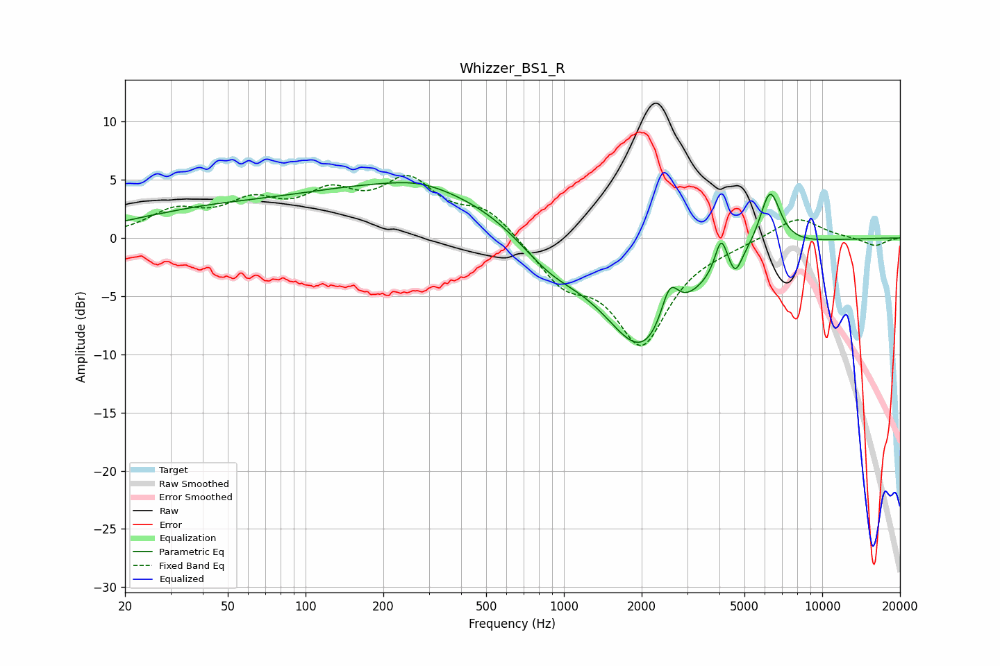

# Whizzer_BS1_R
See [usage instructions](https://github.com/jaakkopasanen/AutoEq#usage) for more options and info.

### Parametric EQs
Apply preamp of -4.8 dB when using parametric equalizer.

|   # | Type    |   Fc (Hz) |    Q |   Gain (dB) |
|-----|---------|-----------|------|-------------|
|   1 | Peaking |        24 | 3.67 |         0   |
|   2 | Peaking |        38 | 0.51 |         1.7 |
|   3 | Peaking |       266 | 0.28 |         4.5 |
|   4 | Peaking |       276 | 1.25 |         0.5 |
|   5 | Peaking |       876 | 1.05 |        -2.8 |
|   6 | Peaking |      2026 | 0.87 |        -9.9 |
|   7 | Peaking |      2568 | 4.08 |         3.5 |
|   8 | Peaking |      4061 | 6    |         2.9 |
|   9 | Peaking |      4609 | 6    |        -1.7 |
|  10 | Peaking |      6279 | 3.38 |         5.1 |

### Fixed Band EQs
When using fixed band (also called graphic) equalizer, apply preamp of **-5.5 dB** (if available) and set gains manually with these parameters.

|   # | Type    |   Fc (Hz) |    Q |   Gain (dB) |
|-----|---------|-----------|------|-------------|
|   1 | Peaking |        31 | 1.41 |         2.1 |
|   2 | Peaking |        62 | 1.41 |         2.6 |
|   3 | Peaking |       125 | 1.41 |         3.1 |
|   4 | Peaking |       250 | 1.41 |         4.4 |
|   5 | Peaking |       500 | 1.41 |         2.4 |
|   6 | Peaking |      1000 | 1.41 |        -3.4 |
|   7 | Peaking |      2000 | 1.41 |        -8.7 |
|   8 | Peaking |      4000 | 1.41 |        -0.3 |
|   9 | Peaking |      8000 | 1.41 |         1.9 |
|  10 | Peaking |     16000 | 1.41 |        -0.7 |

### Graphs

