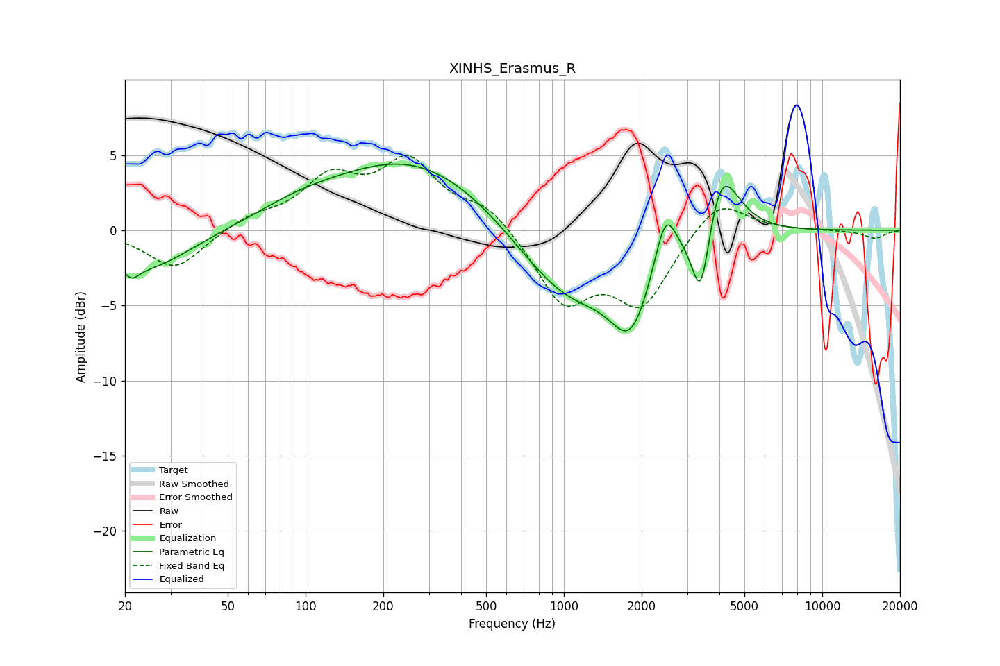

# XINHS_Erasmus_R
See [usage instructions](https://github.com/jaakkopasanen/AutoEq#usage) for more options and info.

### Parametric EQs
Apply preamp of -4.5 dB when using parametric equalizer.

|   # | Type    |   Fc (Hz) |    Q |   Gain (dB) |
|-----|---------|-----------|------|-------------|
|   1 | Peaking |        21 | 5.31 |        -0.7 |
|   2 | Peaking |        24 | 0.79 |        -2.7 |
|   3 | Peaking |        94 | 0.83 |         0.8 |
|   4 | Peaking |       268 | 0.43 |         4.9 |
|   5 | Peaking |      1035 | 0.69 |        -5   |
|   6 | Peaking |      1818 | 1.8  |        -4.9 |
|   7 | Peaking |      2472 | 3.38 |         3.7 |
|   8 | Peaking |      3342 | 3.09 |         0.5 |
|   9 | Peaking |      3392 | 3.77 |        -6.2 |
|  10 | Peaking |      4034 | 2.06 |         5.2 |

### Fixed Band EQs
When using fixed band (also called graphic) equalizer, apply preamp of **-5.1 dB** (if available) and set gains manually with these parameters.

|   # | Type    |   Fc (Hz) |    Q |   Gain (dB) |
|-----|---------|-----------|------|-------------|
|   1 | Peaking |        31 | 1.41 |        -2.6 |
|   2 | Peaking |        62 | 1.41 |         0.8 |
|   3 | Peaking |       125 | 1.41 |         3.2 |
|   4 | Peaking |       250 | 1.41 |         4.3 |
|   5 | Peaking |       500 | 1.41 |         1.6 |
|   6 | Peaking |      1000 | 1.41 |        -4.7 |
|   7 | Peaking |      2000 | 1.41 |        -4.7 |
|   8 | Peaking |      4000 | 1.41 |         2.3 |
|   9 | Peaking |      8000 | 1.41 |         0   |
|  10 | Peaking |     16000 | 1.41 |        -0.5 |

### Graphs

