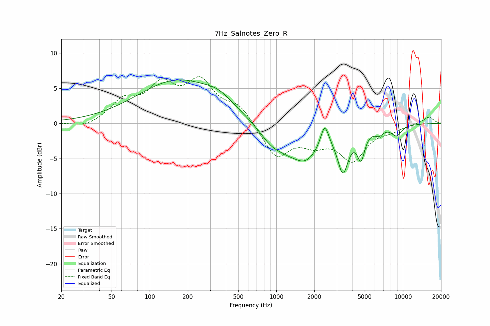

# 7Hz_Salnotes_Zero_R
See [usage instructions](https://github.com/jaakkopasanen/AutoEq#usage) for more options and info.

### Parametric EQs
Apply preamp of -6.3 dB when using parametric equalizer.

|   # | Type    |   Fc (Hz) |    Q |   Gain (dB) |
|-----|---------|-----------|------|-------------|
|   1 | Peaking |       166 | 0.44 |         6.1 |
|   2 | Peaking |       351 | 1.32 |         1.3 |
|   3 | Peaking |       911 | 1.48 |        -1.8 |
|   4 | Peaking |      1436 | 2.62 |         0.5 |
|   5 | Peaking |      1588 | 0.95 |        -5.7 |
|   6 | Peaking |      2409 | 4.22 |         3.5 |
|   7 | Peaking |      3366 | 3.44 |        -5.5 |
|   8 | Peaking |      4669 | 4.73 |        -3.8 |
|   9 | Peaking |      6483 | 4.11 |        -0.9 |
|  10 | Peaking |      8897 | 3.19 |        -1.4 |

### Fixed Band EQs
When using fixed band (also called graphic) equalizer, apply preamp of **-6.7 dB** (if available) and set gains manually with these parameters.

|   # | Type    |   Fc (Hz) |    Q |   Gain (dB) |
|-----|---------|-----------|------|-------------|
|   1 | Peaking |        31 | 1.41 |        -0.7 |
|   2 | Peaking |        62 | 1.41 |         2.9 |
|   3 | Peaking |       125 | 1.41 |         4.8 |
|   4 | Peaking |       250 | 1.41 |         5.4 |
|   5 | Peaking |       500 | 1.41 |         2.4 |
|   6 | Peaking |      1000 | 1.41 |        -4.7 |
|   7 | Peaking |      2000 | 1.41 |        -2.2 |
|   8 | Peaking |      4000 | 1.41 |        -4.9 |
|   9 | Peaking |      8000 | 1.41 |        -0.8 |
|  10 | Peaking |     16000 | 1.41 |         1   |

### Graphs

