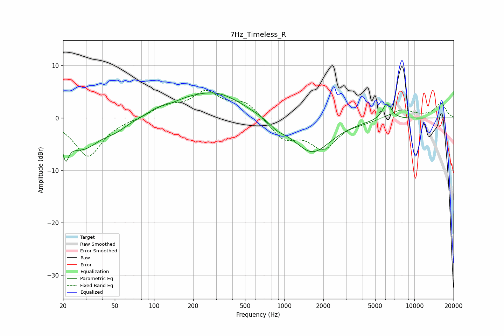

# 7Hz_Timeless_R
See [usage instructions](https://github.com/jaakkopasanen/AutoEq#usage) for more options and info.

### Parametric EQs
Apply preamp of -4.9 dB when using parametric equalizer.

|   # | Type    |   Fc (Hz) |    Q |   Gain (dB) |
|-----|---------|-----------|------|-------------|
|   1 | Peaking |        21 | 5.92 |        -7.3 |
|   2 | Peaking |        21 | 5.92 |         3.3 |
|   3 | Peaking |        28 | 1    |        -5.7 |
|   4 | Peaking |        51 | 1.74 |        -1.1 |
|   5 | Peaking |       107 | 1.89 |         0.9 |
|   6 | Peaking |       171 | 1.26 |         0.9 |
|   7 | Peaking |       297 | 0.65 |         4.8 |
|   8 | Peaking |       880 | 2.27 |        -1.1 |
|   9 | Peaking |      1637 | 0.95 |        -6.7 |
|  10 | Peaking |      6146 | 3.98 |         3.2 |

### Fixed Band EQs
When using fixed band (also called graphic) equalizer, apply preamp of **-5.3 dB** (if available) and set gains manually with these parameters.

|   # | Type    |   Fc (Hz) |    Q |   Gain (dB) |
|-----|---------|-----------|------|-------------|
|   1 | Peaking |        31 | 1.41 |        -7.4 |
|   2 | Peaking |        62 | 1.41 |        -0.1 |
|   3 | Peaking |       125 | 1.41 |         2.1 |
|   4 | Peaking |       250 | 1.41 |         4.6 |
|   5 | Peaking |       500 | 1.41 |         2.9 |
|   6 | Peaking |      1000 | 1.41 |        -3.9 |
|   7 | Peaking |      2000 | 1.41 |        -5.5 |
|   8 | Peaking |      4000 | 1.41 |        -0.6 |
|   9 | Peaking |      8000 | 1.41 |         1.6 |
|  10 | Peaking |     16000 | 1.41 |         2.7 |

### Graphs

