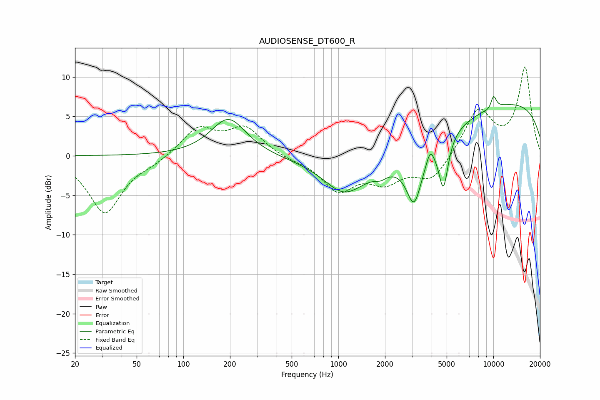

# AUDIOSENSE_DT600_R
See [usage instructions](https://github.com/jaakkopasanen/AutoEq#usage) for more options and info.

### Parametric EQs
Apply preamp of -7.6 dB when using parametric equalizer.

|   # | Type    |   Fc (Hz) |    Q |   Gain (dB) |
|-----|---------|-----------|------|-------------|
|   1 | Peaking |       196 | 1.25 |         4.8 |
|   2 | Peaking |      1083 | 1.17 |        -3.3 |
|   3 | Peaking |      1880 | 4.16 |        -0.6 |
|   4 | Peaking |      2490 | 0.38 |        -4.3 |
|   5 | Peaking |      3084 | 2.82 |        -6.3 |
|   6 | Peaking |      3918 | 5.98 |         1.7 |
|   7 | Peaking |      4764 | 4.67 |        -6.3 |
|   8 | Peaking |      9702 | 0.18 |         7.3 |
|   9 | Peaking |      9835 | 4.22 |        -1.1 |
|  10 | Peaking |     10000 | 5.99 |         2.5 |

### Fixed Band EQs
When using fixed band (also called graphic) equalizer, apply preamp of **-11.4 dB** (if available) and set gains manually with these parameters.

|   # | Type    |   Fc (Hz) |    Q |   Gain (dB) |
|-----|---------|-----------|------|-------------|
|   1 | Peaking |        31 | 1.41 |        -7.2 |
|   2 | Peaking |        62 | 1.41 |        -0.7 |
|   3 | Peaking |       125 | 1.41 |         3.5 |
|   4 | Peaking |       250 | 1.41 |         3.4 |
|   5 | Peaking |       500 | 1.41 |        -0.4 |
|   6 | Peaking |      1000 | 1.41 |        -4.2 |
|   7 | Peaking |      2000 | 1.41 |        -2.9 |
|   8 | Peaking |      4000 | 1.41 |        -3.1 |
|   9 | Peaking |      8000 | 1.41 |         5.8 |
|  10 | Peaking |     16000 | 1.41 |        11.1 |

### Graphs

