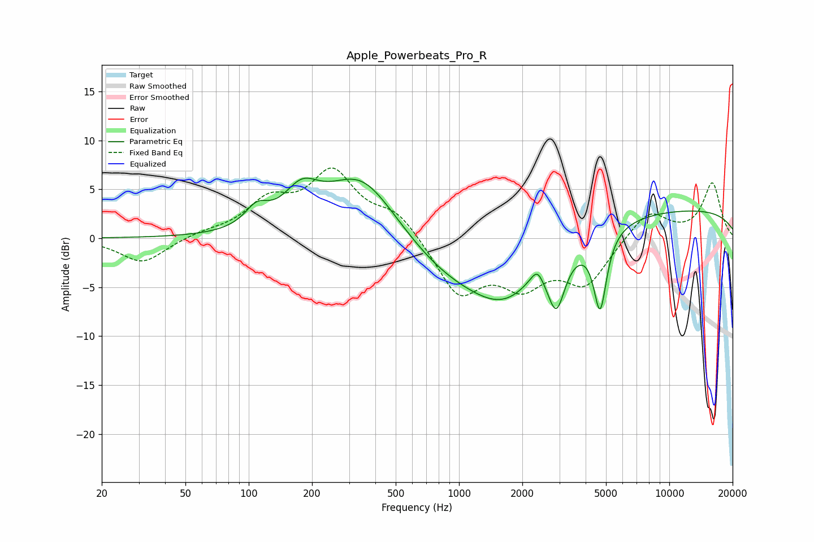

# Apple_Powerbeats_Pro_R
See [usage instructions](https://github.com/jaakkopasanen/AutoEq#usage) for more options and info.

### Parametric EQs
Apply preamp of -6.2 dB when using parametric equalizer.

|   # | Type    |   Fc (Hz) |    Q |   Gain (dB) |
|-----|---------|-----------|------|-------------|
|   1 | Peaking |       109 | 2.55 |         2   |
|   2 | Peaking |       178 | 1.7  |         3.4 |
|   3 | Peaking |       343 | 0.84 |         6.5 |
|   4 | Peaking |       828 | 0.72 |        -2.3 |
|   5 | Peaking |      1672 | 0.71 |        -6.6 |
|   6 | Peaking |      2293 | 2.28 |         1   |
|   7 | Peaking |      2357 | 5.4  |         1.1 |
|   8 | Peaking |      2903 | 3.44 |        -5.3 |
|   9 | Peaking |      4689 | 4.52 |        -7.9 |
|  10 | Peaking |      9903 | 0.19 |         3   |

### Fixed Band EQs
When using fixed band (also called graphic) equalizer, apply preamp of **-7.3 dB** (if available) and set gains manually with these parameters.

|   # | Type    |   Fc (Hz) |    Q |   Gain (dB) |
|-----|---------|-----------|------|-------------|
|   1 | Peaking |        31 | 1.41 |        -2.6 |
|   2 | Peaking |        62 | 1.41 |         0.5 |
|   3 | Peaking |       125 | 1.41 |         3.4 |
|   4 | Peaking |       250 | 1.41 |         6.3 |
|   5 | Peaking |       500 | 1.41 |         2.5 |
|   6 | Peaking |      1000 | 1.41 |        -5.6 |
|   7 | Peaking |      2000 | 1.41 |        -4.1 |
|   8 | Peaking |      4000 | 1.41 |        -4.5 |
|   9 | Peaking |      8000 | 1.41 |         2.9 |
|  10 | Peaking |     16000 | 1.41 |         5.6 |

### Graphs

