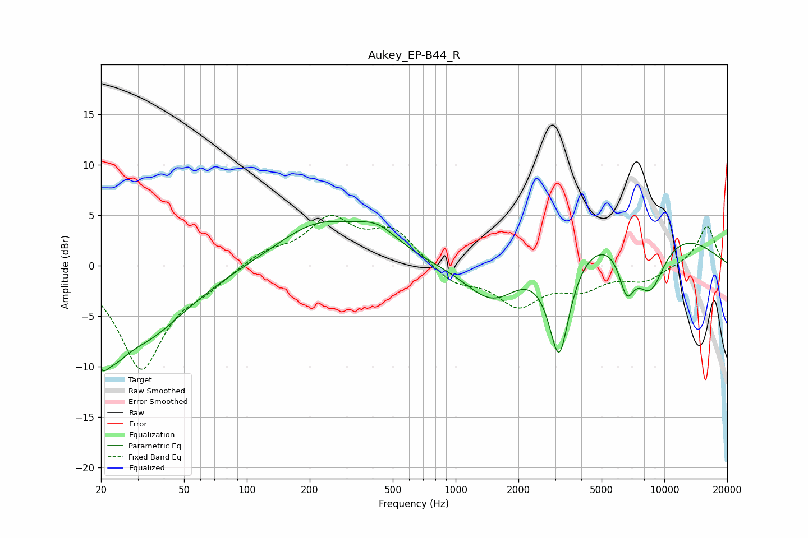

# Aukey_EP-B44_R
See [usage instructions](https://github.com/jaakkopasanen/AutoEq#usage) for more options and info.

### Parametric EQs
Apply preamp of -4.4 dB when using parametric equalizer.

|   # | Type    |   Fc (Hz) |    Q |   Gain (dB) |
|-----|---------|-----------|------|-------------|
|   1 | Peaking |        20 | 3.71 |        -3.9 |
|   2 | Peaking |        24 | 2.48 |        -2   |
|   3 | Peaking |        31 | 0.64 |        -7.1 |
|   4 | Peaking |       221 | 0.69 |         4.1 |
|   5 | Peaking |       423 | 1.36 |         2.2 |
|   6 | Peaking |      1512 | 1.02 |        -4.8 |
|   7 | Peaking |      3133 | 2.64 |       -11   |
|   8 | Peaking |      6233 | 0.28 |         4.8 |
|   9 | Peaking |      6601 | 3.54 |        -4.3 |
|  10 | Peaking |      8538 | 1.7  |        -6   |

### Fixed Band EQs
When using fixed band (also called graphic) equalizer, apply preamp of **-5.0 dB** (if available) and set gains manually with these parameters.

|   # | Type    |   Fc (Hz) |    Q |   Gain (dB) |
|-----|---------|-----------|------|-------------|
|   1 | Peaking |        31 | 1.41 |       -10.1 |
|   2 | Peaking |        62 | 1.41 |        -1.5 |
|   3 | Peaking |       125 | 1.41 |         1.3 |
|   4 | Peaking |       250 | 1.41 |         4.3 |
|   5 | Peaking |       500 | 1.41 |         3.3 |
|   6 | Peaking |      1000 | 1.41 |        -1.7 |
|   7 | Peaking |      2000 | 1.41 |        -3.7 |
|   8 | Peaking |      4000 | 1.41 |        -2   |
|   9 | Peaking |      8000 | 1.41 |        -1.4 |
|  10 | Peaking |     16000 | 1.41 |         4   |

### Graphs

