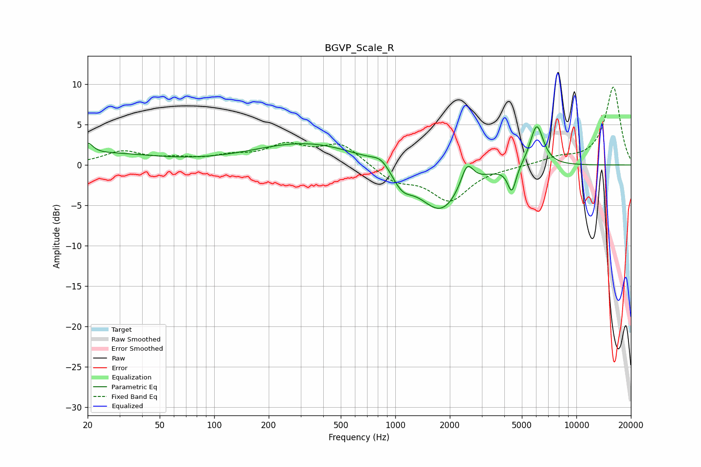

# BGVP_Scale_R
See [usage instructions](https://github.com/jaakkopasanen/AutoEq#usage) for more options and info.

### Parametric EQs
Apply preamp of -4.8 dB when using parametric equalizer.

|   # | Type    |   Fc (Hz) |    Q |   Gain (dB) |
|-----|---------|-----------|------|-------------|
|   1 | Peaking |        20 | 4.94 |         1.4 |
|   2 | Peaking |        26 | 0.55 |         1.3 |
|   3 | Peaking |       325 | 0.48 |         2.7 |
|   4 | Peaking |       838 | 2.8  |         1.2 |
|   5 | Peaking |      1088 | 2.48 |        -2.2 |
|   6 | Peaking |      1610 | 1.15 |        -0.6 |
|   7 | Peaking |      1799 | 1.21 |        -5.3 |
|   8 | Peaking |      2490 | 4.11 |         3   |
|   9 | Peaking |      4403 | 6    |        -3.2 |
|  10 | Peaking |      6040 | 3.71 |         5.2 |

### Fixed Band EQs
When using fixed band (also called graphic) equalizer, apply preamp of **-9.7 dB** (if available) and set gains manually with these parameters.

|   # | Type    |   Fc (Hz) |    Q |   Gain (dB) |
|-----|---------|-----------|------|-------------|
|   1 | Peaking |        31 | 1.41 |         1.6 |
|   2 | Peaking |        62 | 1.41 |         0.6 |
|   3 | Peaking |       125 | 1.41 |         0.9 |
|   4 | Peaking |       250 | 1.41 |         2.2 |
|   5 | Peaking |       500 | 1.41 |         2.6 |
|   6 | Peaking |      1000 | 1.41 |        -1.9 |
|   7 | Peaking |      2000 | 1.41 |        -4.2 |
|   8 | Peaking |      4000 | 1.41 |        -0.2 |
|   9 | Peaking |      8000 | 1.41 |         0.8 |
|  10 | Peaking |     16000 | 1.41 |         9.7 |

### Graphs

