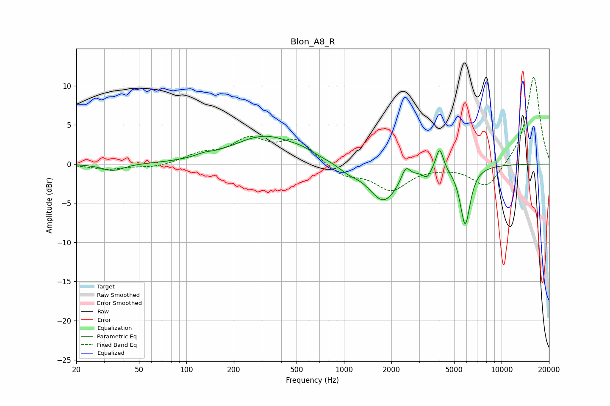

# Blon_A8_R
See [usage instructions](https://github.com/jaakkopasanen/AutoEq#usage) for more options and info.

### Parametric EQs
Apply preamp of -3.6 dB when using parametric equalizer.

|   # | Type    |   Fc (Hz) |    Q |   Gain (dB) |
|-----|---------|-----------|------|-------------|
|   1 | Peaking |        34 | 2.04 |        -0.9 |
|   2 | Peaking |       129 | 2.72 |         0.3 |
|   3 | Peaking |       317 | 0.7  |         3.6 |
|   4 | Peaking |       540 | 2.17 |         0.4 |
|   5 | Peaking |      1065 | 2.28 |        -0.7 |
|   6 | Peaking |      1782 | 1.49 |        -4.8 |
|   7 | Peaking |      2466 | 5.18 |         1.8 |
|   8 | Peaking |      3360 | 5.84 |        -1.1 |
|   9 | Peaking |      4044 | 6    |         3   |
|  10 | Peaking |      5879 | 4.28 |        -7.6 |

### Fixed Band EQs
When using fixed band (also called graphic) equalizer, apply preamp of **-11.2 dB** (if available) and set gains manually with these parameters.

|   # | Type    |   Fc (Hz) |    Q |   Gain (dB) |
|-----|---------|-----------|------|-------------|
|   1 | Peaking |        31 | 1.41 |        -0.7 |
|   2 | Peaking |        62 | 1.41 |        -0.5 |
|   3 | Peaking |       125 | 1.41 |         1.1 |
|   4 | Peaking |       250 | 1.41 |         2.9 |
|   5 | Peaking |       500 | 1.41 |         2.9 |
|   6 | Peaking |      1000 | 1.41 |        -1.5 |
|   7 | Peaking |      2000 | 1.41 |        -3.2 |
|   8 | Peaking |      4000 | 1.41 |        -0.2 |
|   9 | Peaking |      8000 | 1.41 |        -3.2 |
|  10 | Peaking |     16000 | 1.41 |        11.4 |

### Graphs

