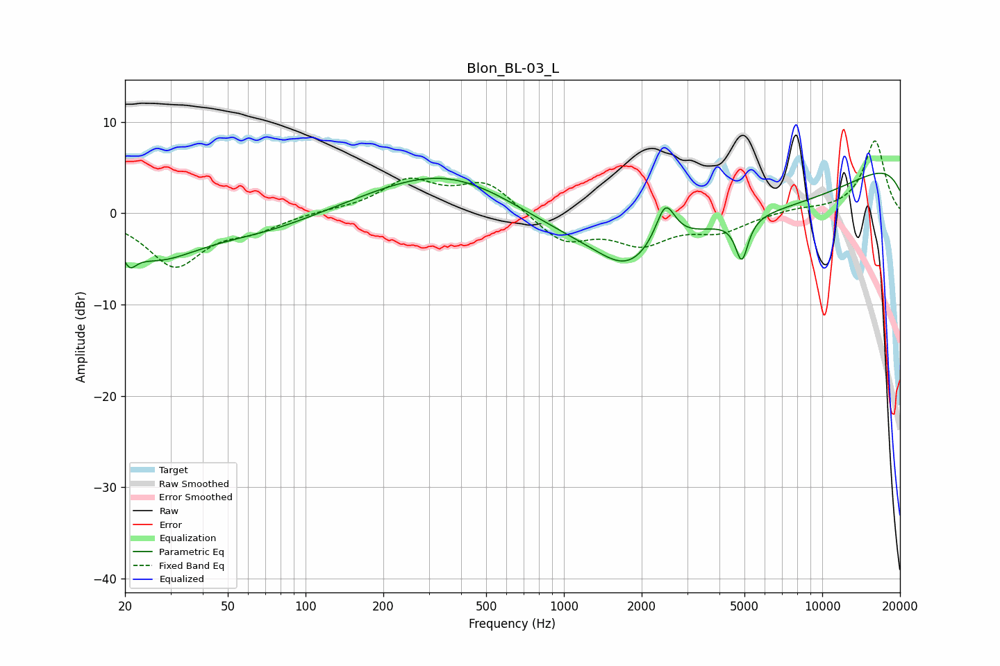

# Blon_BL-03_L
See [usage instructions](https://github.com/jaakkopasanen/AutoEq#usage) for more options and info.

### Parametric EQs
Apply preamp of -4.5 dB when using parametric equalizer.

|   # | Type    |   Fc (Hz) |    Q |   Gain (dB) |
|-----|---------|-----------|------|-------------|
|   1 | Peaking |        21 | 5.68 |         2.6 |
|   2 | Peaking |        21 | 5.64 |        -4.3 |
|   3 | Peaking |        26 | 0.84 |        -4.4 |
|   4 | Peaking |        67 | 0.61 |        -1.8 |
|   5 | Peaking |       364 | 0.48 |         5.3 |
|   6 | Peaking |      1756 | 1.32 |        -3.1 |
|   7 | Peaking |      2471 | 3.72 |         4.6 |
|   8 | Peaking |      3954 | 0.19 |        -7.8 |
|   9 | Peaking |      4883 | 5.69 |        -4.5 |
|  10 | Peaking |     10000 | 0.18 |         8.2 |

### Fixed Band EQs
When using fixed band (also called graphic) equalizer, apply preamp of **-8.0 dB** (if available) and set gains manually with these parameters.

|   # | Type    |   Fc (Hz) |    Q |   Gain (dB) |
|-----|---------|-----------|------|-------------|
|   1 | Peaking |        31 | 1.41 |        -5.7 |
|   2 | Peaking |        62 | 1.41 |        -1.5 |
|   3 | Peaking |       125 | 1.41 |         0.2 |
|   4 | Peaking |       250 | 1.41 |         3.4 |
|   5 | Peaking |       500 | 1.41 |         3.3 |
|   6 | Peaking |      1000 | 1.41 |        -3.1 |
|   7 | Peaking |      2000 | 1.41 |        -3   |
|   8 | Peaking |      4000 | 1.41 |        -1.8 |
|   9 | Peaking |      8000 | 1.41 |         0.4 |
|  10 | Peaking |     16000 | 1.41 |         8   |

### Graphs

