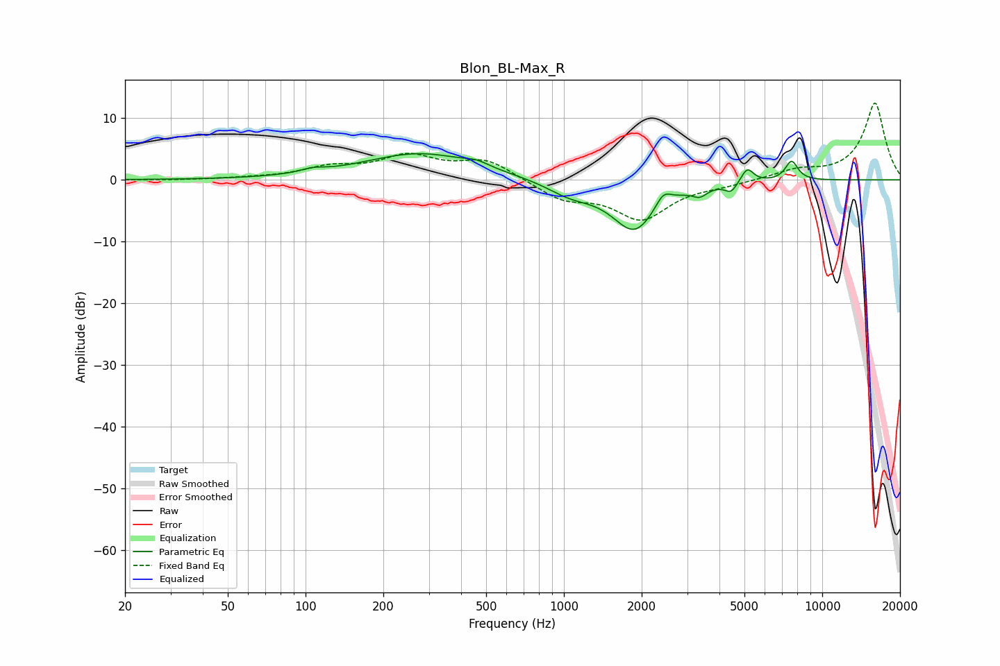

# Blon_BL-Max_R
See [usage instructions](https://github.com/jaakkopasanen/AutoEq#usage) for more options and info.

### Parametric EQs
Apply preamp of -4.3 dB when using parametric equalizer.

|   # | Type    |   Fc (Hz) |    Q |   Gain (dB) |
|-----|---------|-----------|------|-------------|
|   1 | Peaking |       107 | 3.17 |         0.6 |
|   2 | Peaking |       278 | 0.65 |         4.3 |
|   3 | Peaking |       460 | 3.19 |         0.7 |
|   4 | Peaking |      1058 | 1.53 |        -2   |
|   5 | Peaking |      1875 | 1.59 |        -8.1 |
|   6 | Peaking |      2427 | 4.64 |         2.3 |
|   7 | Peaking |      3361 | 5    |        -1.3 |
|   8 | Peaking |      4437 | 6    |        -1.5 |
|   9 | Peaking |      5125 | 5.81 |         2.4 |
|  10 | Peaking |      7607 | 5.43 |         3.2 |

### Fixed Band EQs
When using fixed band (also called graphic) equalizer, apply preamp of **-12.5 dB** (if available) and set gains manually with these parameters.

|   # | Type    |   Fc (Hz) |    Q |   Gain (dB) |
|-----|---------|-----------|------|-------------|
|   1 | Peaking |        31 | 1.41 |        -0.1 |
|   2 | Peaking |        62 | 1.41 |         0.2 |
|   3 | Peaking |       125 | 1.41 |         1.8 |
|   4 | Peaking |       250 | 1.41 |         3.5 |
|   5 | Peaking |       500 | 1.41 |         3.1 |
|   6 | Peaking |      1000 | 1.41 |        -2.9 |
|   7 | Peaking |      2000 | 1.41 |        -6.1 |
|   8 | Peaking |      4000 | 1.41 |        -0.6 |
|   9 | Peaking |      8000 | 1.41 |         1.4 |
|  10 | Peaking |     16000 | 1.41 |        12.5 |

### Graphs

