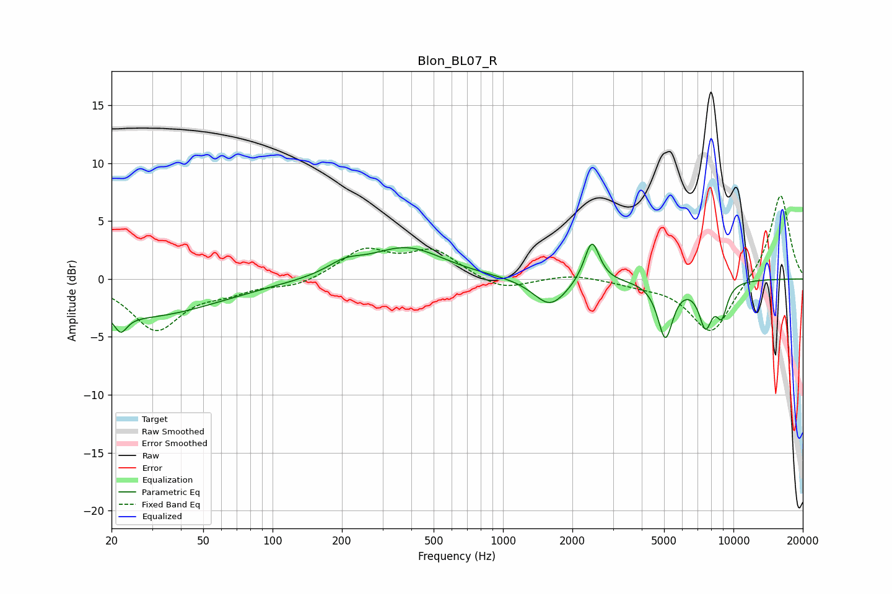

# Blon_BL07_R
See [usage instructions](https://github.com/jaakkopasanen/AutoEq#usage) for more options and info.

### Parametric EQs
Apply preamp of -3.1 dB when using parametric equalizer.

|   # | Type    |   Fc (Hz) |    Q |   Gain (dB) |
|-----|---------|-----------|------|-------------|
|   1 | Peaking |        22 | 5.28 |        -1.5 |
|   2 | Peaking |        27 | 0.43 |        -3.2 |
|   3 | Peaking |       206 | 1.86 |         1   |
|   4 | Peaking |       381 | 0.88 |         2.6 |
|   5 | Peaking |       411 | 1.23 |         0   |
|   6 | Peaking |      1603 | 1.96 |        -2.4 |
|   7 | Peaking |      2431 | 4.34 |         3.7 |
|   8 | Peaking |      5064 | 4.24 |        -4.9 |
|   9 | Peaking |      7569 | 4.53 |        -3.6 |
|  10 | Peaking |      8899 | 5.26 |        -2.6 |

### Fixed Band EQs
When using fixed band (also called graphic) equalizer, apply preamp of **-7.3 dB** (if available) and set gains manually with these parameters.

|   # | Type    |   Fc (Hz) |    Q |   Gain (dB) |
|-----|---------|-----------|------|-------------|
|   1 | Peaking |        31 | 1.41 |        -4.3 |
|   2 | Peaking |        62 | 1.41 |        -0.9 |
|   3 | Peaking |       125 | 1.41 |        -0.7 |
|   4 | Peaking |       250 | 1.41 |         2.4 |
|   5 | Peaking |       500 | 1.41 |         2.3 |
|   6 | Peaking |      1000 | 1.41 |        -1.1 |
|   7 | Peaking |      2000 | 1.41 |         0.4 |
|   8 | Peaking |      4000 | 1.41 |        -0.4 |
|   9 | Peaking |      8000 | 1.41 |        -4.8 |
|  10 | Peaking |     16000 | 1.41 |         7.5 |

### Graphs

