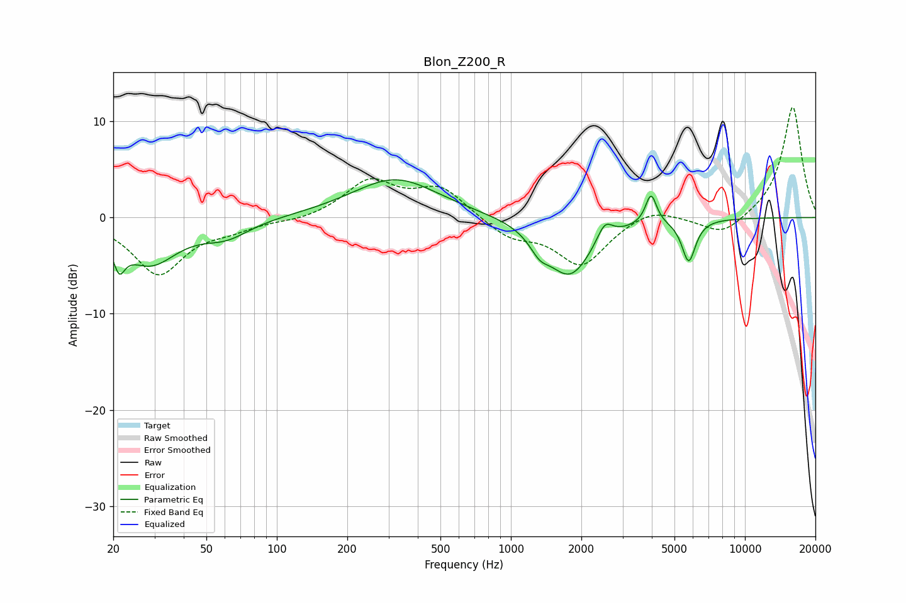

# Blon_Z200_R
See [usage instructions](https://github.com/jaakkopasanen/AutoEq#usage) for more options and info.

### Parametric EQs
Apply preamp of -4.0 dB when using parametric equalizer.

|   # | Type    |   Fc (Hz) |    Q |   Gain (dB) |
|-----|---------|-----------|------|-------------|
|   1 | Peaking |        21 | 6    |         2.8 |
|   2 | Peaking |        21 | 5.85 |        -5.6 |
|   3 | Peaking |        29 | 1.21 |        -4.6 |
|   4 | Peaking |        61 | 1.39 |        -1.7 |
|   5 | Peaking |       321 | 0.77 |         4.1 |
|   6 | Peaking |      1326 | 3.39 |        -1.6 |
|   7 | Peaking |      1785 | 1.46 |        -6   |
|   8 | Peaking |      2518 | 4.27 |         1.9 |
|   9 | Peaking |      3970 | 5.99 |         3.2 |
|  10 | Peaking |      5751 | 4.8  |        -4.4 |

### Fixed Band EQs
When using fixed band (also called graphic) equalizer, apply preamp of **-11.5 dB** (if available) and set gains manually with these parameters.

|   # | Type    |   Fc (Hz) |    Q |   Gain (dB) |
|-----|---------|-----------|------|-------------|
|   1 | Peaking |        31 | 1.41 |        -5.8 |
|   2 | Peaking |        62 | 1.41 |        -0.9 |
|   3 | Peaking |       125 | 1.41 |        -0.4 |
|   4 | Peaking |       250 | 1.41 |         3.7 |
|   5 | Peaking |       500 | 1.41 |         3   |
|   6 | Peaking |      1000 | 1.41 |        -1.9 |
|   7 | Peaking |      2000 | 1.41 |        -4.9 |
|   8 | Peaking |      4000 | 1.41 |         1.2 |
|   9 | Peaking |      8000 | 1.41 |        -2   |
|  10 | Peaking |     16000 | 1.41 |        11.6 |

### Graphs

