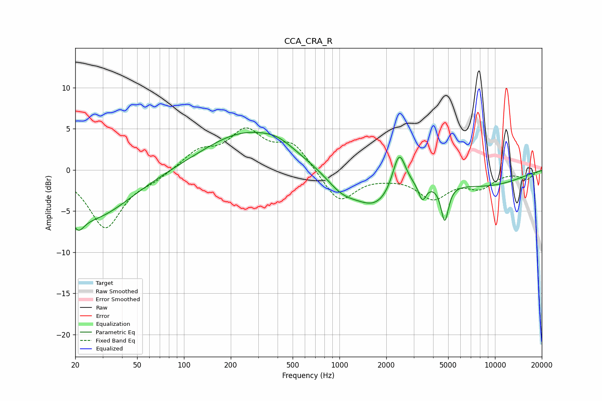

# CCA_CRA_R
See [usage instructions](https://github.com/jaakkopasanen/AutoEq#usage) for more options and info.

### Parametric EQs
Apply preamp of -4.7 dB when using parametric equalizer.

|   # | Type    |   Fc (Hz) |    Q |   Gain (dB) |
|-----|---------|-----------|------|-------------|
|   1 | Peaking |        21 | 3.77 |        -2   |
|   2 | Peaking |        26 | 0.58 |        -5.8 |
|   3 | Peaking |       245 | 0.53 |         4.5 |
|   4 | Peaking |       402 | 1.35 |         1   |
|   5 | Peaking |      1034 | 1.36 |        -2   |
|   6 | Peaking |      1729 | 1.01 |        -4.1 |
|   7 | Peaking |      2418 | 3.33 |         4.9 |
|   8 | Peaking |      3414 | 5.8  |        -2.1 |
|   9 | Peaking |      4754 | 5.84 |        -4.5 |
|  10 | Peaking |      8561 | 0.48 |        -1.8 |

### Fixed Band EQs
When using fixed band (also called graphic) equalizer, apply preamp of **-5.2 dB** (if available) and set gains manually with these parameters.

|   # | Type    |   Fc (Hz) |    Q |   Gain (dB) |
|-----|---------|-----------|------|-------------|
|   1 | Peaking |        31 | 1.41 |        -7   |
|   2 | Peaking |        62 | 1.41 |        -0.9 |
|   3 | Peaking |       125 | 1.41 |         2.1 |
|   4 | Peaking |       250 | 1.41 |         4.4 |
|   5 | Peaking |       500 | 1.41 |         3.1 |
|   6 | Peaking |      1000 | 1.41 |        -4   |
|   7 | Peaking |      2000 | 1.41 |        -0.4 |
|   8 | Peaking |      4000 | 1.41 |        -3.2 |
|   9 | Peaking |      8000 | 1.41 |        -1.9 |
|  10 | Peaking |     16000 | 1.41 |        -1   |

### Graphs

