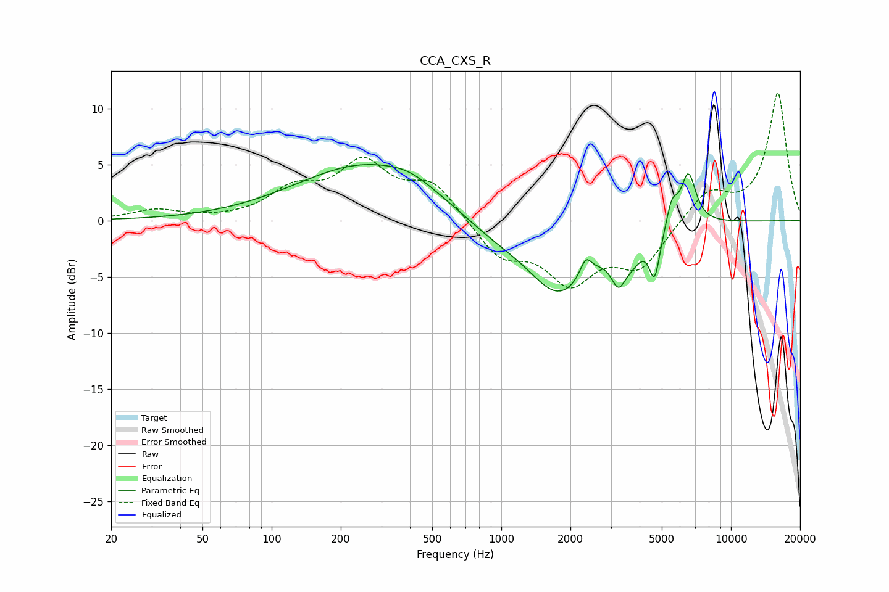

# CCA_CXS_R
See [usage instructions](https://github.com/jaakkopasanen/AutoEq#usage) for more options and info.

### Parametric EQs
Apply preamp of -5.1 dB when using parametric equalizer.

|   # | Type    |   Fc (Hz) |    Q |   Gain (dB) |
|-----|---------|-----------|------|-------------|
|   1 | Peaking |       264 | 0.46 |         5.1 |
|   2 | Peaking |       400 | 1.59 |         0.6 |
|   3 | Peaking |       904 | 0.93 |        -1.3 |
|   4 | Peaking |      1788 | 1    |        -6.4 |
|   5 | Peaking |      2333 | 5.67 |         1.7 |
|   6 | Peaking |      3237 | 4.3  |        -2.9 |
|   7 | Peaking |      3724 | 3.38 |        -1.4 |
|   8 | Peaking |      4652 | 5.84 |        -4.1 |
|   9 | Peaking |      5531 | 5.88 |         2.1 |
|  10 | Peaking |      6525 | 4.14 |         4.6 |

### Fixed Band EQs
When using fixed band (also called graphic) equalizer, apply preamp of **-11.4 dB** (if available) and set gains manually with these parameters.

|   # | Type    |   Fc (Hz) |    Q |   Gain (dB) |
|-----|---------|-----------|------|-------------|
|   1 | Peaking |        31 | 1.41 |         0.9 |
|   2 | Peaking |        62 | 1.41 |         0   |
|   3 | Peaking |       125 | 1.41 |         2.5 |
|   4 | Peaking |       250 | 1.41 |         4.7 |
|   5 | Peaking |       500 | 1.41 |         3.2 |
|   6 | Peaking |      1000 | 1.41 |        -3.1 |
|   7 | Peaking |      2000 | 1.41 |        -5   |
|   8 | Peaking |      4000 | 1.41 |        -3.9 |
|   9 | Peaking |      8000 | 1.41 |         2.6 |
|  10 | Peaking |     16000 | 1.41 |        11.3 |

### Graphs

