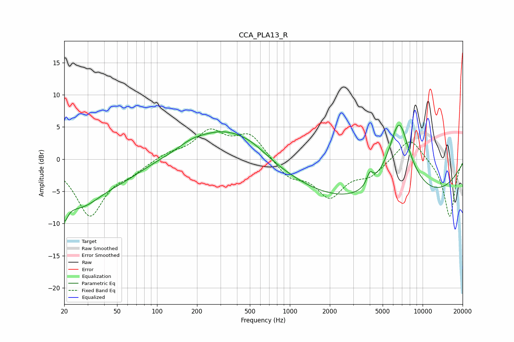

# CCA_PLA13_R
See [usage instructions](https://github.com/jaakkopasanen/AutoEq#usage) for more options and info.

### Parametric EQs
Apply preamp of -5.4 dB when using parametric equalizer.

|   # | Type    |   Fc (Hz) |    Q |   Gain (dB) |
|-----|---------|-----------|------|-------------|
|   1 | Peaking |        20 | 5.1  |        -4.6 |
|   2 | Peaking |        20 | 5.64 |         1.1 |
|   3 | Peaking |        26 | 0.74 |        -6.8 |
|   4 | Peaking |        58 | 0.84 |        -1.3 |
|   5 | Peaking |       180 | 1.47 |         0.8 |
|   6 | Peaking |       312 | 0.62 |         4.4 |
|   7 | Peaking |       514 | 1.07 |         1.2 |
|   8 | Peaking |      4005 | 6    |         1.9 |
|   9 | Peaking |      5391 | 0.18 |        -7.6 |
|  10 | Peaking |      6644 | 1.48 |        12.8 |

### Fixed Band EQs
When using fixed band (also called graphic) equalizer, apply preamp of **-4.8 dB** (if available) and set gains manually with these parameters.

|   # | Type    |   Fc (Hz) |    Q |   Gain (dB) |
|-----|---------|-----------|------|-------------|
|   1 | Peaking |        31 | 1.41 |        -8.6 |
|   2 | Peaking |        62 | 1.41 |        -1.5 |
|   3 | Peaking |       125 | 1.41 |         0.9 |
|   4 | Peaking |       250 | 1.41 |         4.1 |
|   5 | Peaking |       500 | 1.41 |         3.8 |
|   6 | Peaking |      1000 | 1.41 |        -2.7 |
|   7 | Peaking |      2000 | 1.41 |        -5.5 |
|   8 | Peaking |      4000 | 1.41 |        -2.2 |
|   9 | Peaking |      8000 | 1.41 |         3.7 |
|  10 | Peaking |     16000 | 1.41 |        -9.1 |

### Graphs

