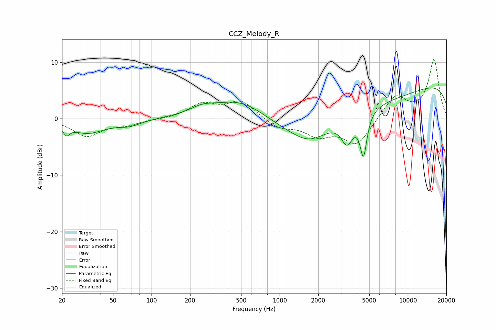

# CCZ_Melody_R
See [usage instructions](https://github.com/jaakkopasanen/AutoEq#usage) for more options and info.

### Parametric EQs
Apply preamp of -5.5 dB when using parametric equalizer.

|   # | Type    |   Fc (Hz) |    Q |   Gain (dB) |
|-----|---------|-----------|------|-------------|
|   1 | Peaking |        22 | 5.71 |        -1.5 |
|   2 | Peaking |        32 | 1.04 |        -2.5 |
|   3 | Peaking |        67 | 1.54 |        -1   |
|   4 | Peaking |       247 | 1.5  |         1.1 |
|   5 | Peaking |       503 | 0.65 |         4.3 |
|   6 | Peaking |      1707 | 1    |        -3   |
|   7 | Peaking |      3277 | 0.18 |        -4.5 |
|   8 | Peaking |      3366 | 3.07 |        -4.4 |
|   9 | Peaking |      4510 | 5.21 |        -7.5 |
|  10 | Peaking |     10000 | 0.18 |         7.7 |

### Fixed Band EQs
When using fixed band (also called graphic) equalizer, apply preamp of **-10.6 dB** (if available) and set gains manually with these parameters.

|   # | Type    |   Fc (Hz) |    Q |   Gain (dB) |
|-----|---------|-----------|------|-------------|
|   1 | Peaking |        31 | 1.41 |        -3   |
|   2 | Peaking |        62 | 1.41 |        -0.9 |
|   3 | Peaking |       125 | 1.41 |        -0.1 |
|   4 | Peaking |       250 | 1.41 |         2.5 |
|   5 | Peaking |       500 | 1.41 |         3.1 |
|   6 | Peaking |      1000 | 1.41 |        -1.6 |
|   7 | Peaking |      2000 | 1.41 |        -2.7 |
|   8 | Peaking |      4000 | 1.41 |        -4.6 |
|   9 | Peaking |      8000 | 1.41 |         4.1 |
|  10 | Peaking |     16000 | 1.41 |        10.4 |

### Graphs

