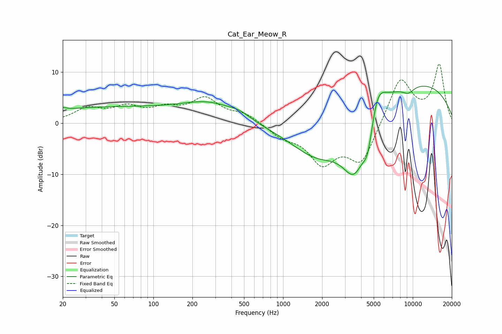

# Cat_Ear_Meow_R
See [usage instructions](https://github.com/jaakkopasanen/AutoEq#usage) for more options and info.

### Parametric EQs
Apply preamp of -7.3 dB when using parametric equalizer.

|   # | Type    |   Fc (Hz) |    Q |   Gain (dB) |
|-----|---------|-----------|------|-------------|
|   1 | Peaking |        20 | 5.43 |         0.4 |
|   2 | Peaking |        45 | 0.23 |         3   |
|   3 | Peaking |       274 | 0.68 |         3.1 |
|   4 | Peaking |       459 | 1.75 |         1   |
|   5 | Peaking |      1844 | 0.64 |        -7.6 |
|   6 | Peaking |      3538 | 1.29 |       -12   |
|   7 | Peaking |      4506 | 3.37 |        -5.9 |
|   8 | Peaking |      5323 | 2.22 |         6.2 |
|   9 | Peaking |      8787 | 0.23 |         8.5 |
|  10 | Peaking |      9238 | 2.71 |        -1.4 |

### Fixed Band EQs
When using fixed band (also called graphic) equalizer, apply preamp of **-11.7 dB** (if available) and set gains manually with these parameters.

|   # | Type    |   Fc (Hz) |    Q |   Gain (dB) |
|-----|---------|-----------|------|-------------|
|   1 | Peaking |        31 | 1.41 |         2.6 |
|   2 | Peaking |        62 | 1.41 |         2.7 |
|   3 | Peaking |       125 | 1.41 |         2.3 |
|   4 | Peaking |       250 | 1.41 |         4.5 |
|   5 | Peaking |       500 | 1.41 |         1.7 |
|   6 | Peaking |      1000 | 1.41 |        -2.2 |
|   7 | Peaking |      2000 | 1.41 |        -7.1 |
|   8 | Peaking |      4000 | 1.41 |        -7.7 |
|   9 | Peaking |      8000 | 1.41 |         9.1 |
|  10 | Peaking |     16000 | 1.41 |        11.2 |

### Graphs

