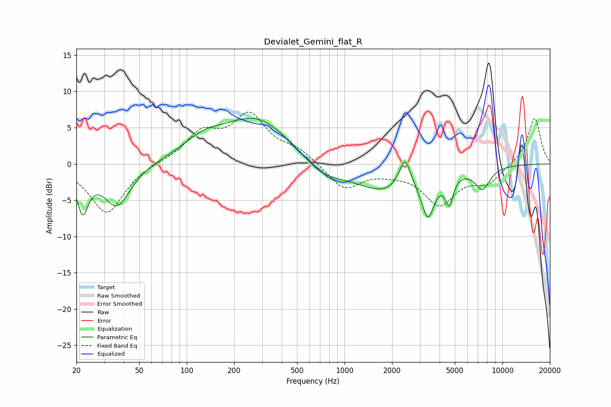

# Devialet_Gemini_flat_R
See [usage instructions](https://github.com/jaakkopasanen/AutoEq#usage) for more options and info.

### Parametric EQs
Apply preamp of -6.4 dB when using parametric equalizer.

|   # | Type    |   Fc (Hz) |    Q |   Gain (dB) |
|-----|---------|-----------|------|-------------|
|   1 | Peaking |        22 | 3.95 |        -5.7 |
|   2 | Peaking |        36 | 1.65 |        -5.9 |
|   3 | Peaking |       128 | 1.07 |         2.2 |
|   4 | Peaking |       279 | 0.65 |         6.2 |
|   5 | Peaking |       728 | 1.13 |        -2.1 |
|   6 | Peaking |      1821 | 0.71 |        -3.8 |
|   7 | Peaking |      2412 | 3.89 |         4.3 |
|   8 | Peaking |      3380 | 3.56 |        -5.6 |
|   9 | Peaking |      4611 | 5.7  |        -3.7 |
|  10 | Peaking |      7477 | 2.8  |        -3   |

### Fixed Band EQs
When using fixed band (also called graphic) equalizer, apply preamp of **-7.2 dB** (if available) and set gains manually with these parameters.

|   # | Type    |   Fc (Hz) |    Q |   Gain (dB) |
|-----|---------|-----------|------|-------------|
|   1 | Peaking |        31 | 1.41 |        -6.9 |
|   2 | Peaking |        62 | 1.41 |         0.2 |
|   3 | Peaking |       125 | 1.41 |         3.9 |
|   4 | Peaking |       250 | 1.41 |         6.3 |
|   5 | Peaking |       500 | 1.41 |         1.7 |
|   6 | Peaking |      1000 | 1.41 |        -3.5 |
|   7 | Peaking |      2000 | 1.41 |        -0.7 |
|   8 | Peaking |      4000 | 1.41 |        -5.3 |
|   9 | Peaking |      8000 | 1.41 |        -2.4 |
|  10 | Peaking |     16000 | 1.41 |         6.4 |

### Graphs

