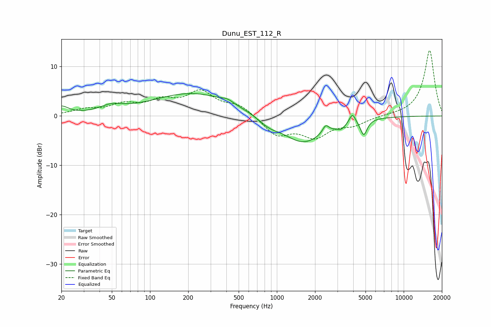

# Dunu_EST_112_R
See [usage instructions](https://github.com/jaakkopasanen/AutoEq#usage) for more options and info.

### Parametric EQs
Apply preamp of -4.6 dB when using parametric equalizer.

|   # | Type    |   Fc (Hz) |    Q |   Gain (dB) |
|-----|---------|-----------|------|-------------|
|   1 | Peaking |        20 | 2.57 |         1.7 |
|   2 | Peaking |        49 | 1.52 |         1.4 |
|   3 | Peaking |       219 | 0.43 |         4.6 |
|   4 | Peaking |       407 | 3.26 |         0.6 |
|   5 | Peaking |       862 | 1.7  |        -1.4 |
|   6 | Peaking |      1616 | 0.87 |        -5.5 |
|   7 | Peaking |      2424 | 6    |         1.5 |
|   8 | Peaking |      3207 | 4.16 |        -1   |
|   9 | Peaking |      3941 | 6    |         2   |
|  10 | Peaking |      4844 | 5.33 |        -3.2 |

### Fixed Band EQs
When using fixed band (also called graphic) equalizer, apply preamp of **-13.3 dB** (if available) and set gains manually with these parameters.

|   # | Type    |   Fc (Hz) |    Q |   Gain (dB) |
|-----|---------|-----------|------|-------------|
|   1 | Peaking |        31 | 1.41 |         1.1 |
|   2 | Peaking |        62 | 1.41 |         2   |
|   3 | Peaking |       125 | 1.41 |         2.6 |
|   4 | Peaking |       250 | 1.41 |         4.5 |
|   5 | Peaking |       500 | 1.41 |         2.1 |
|   6 | Peaking |      1000 | 1.41 |        -3.8 |
|   7 | Peaking |      2000 | 1.41 |        -3.9 |
|   8 | Peaking |      4000 | 1.41 |        -1.6 |
|   9 | Peaking |      8000 | 1.41 |         0.1 |
|  10 | Peaking |     16000 | 1.41 |        13.4 |

### Graphs

