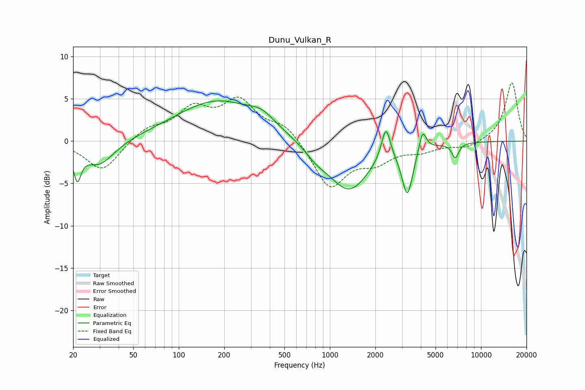

# Dunu_Vulkan_R
See [usage instructions](https://github.com/jaakkopasanen/AutoEq#usage) for more options and info.

### Parametric EQs
Apply preamp of -4.9 dB when using parametric equalizer.

|   # | Type    |   Fc (Hz) |    Q |   Gain (dB) |
|-----|---------|-----------|------|-------------|
|   1 | Peaking |        21 | 5.82 |        -3.5 |
|   2 | Peaking |        30 | 1.38 |        -3   |
|   3 | Peaking |       180 | 0.51 |         4.7 |
|   4 | Peaking |       355 | 1.71 |         1.2 |
|   5 | Peaking |       817 | 1.81 |        -1.1 |
|   6 | Peaking |      1338 | 1.05 |        -5.8 |
|   7 | Peaking |      2348 | 4.77 |         4   |
|   8 | Peaking |      3258 | 3.94 |        -5.7 |
|   9 | Peaking |      4111 | 5.91 |         2.5 |
|  10 | Peaking |      6761 | 6    |        -1.8 |

### Fixed Band EQs
When using fixed band (also called graphic) equalizer, apply preamp of **-7.0 dB** (if available) and set gains manually with these parameters.

|   # | Type    |   Fc (Hz) |    Q |   Gain (dB) |
|-----|---------|-----------|------|-------------|
|   1 | Peaking |        31 | 1.41 |        -3.6 |
|   2 | Peaking |        62 | 1.41 |         1.5 |
|   3 | Peaking |       125 | 1.41 |         3.5 |
|   4 | Peaking |       250 | 1.41 |         4.4 |
|   5 | Peaking |       500 | 1.41 |         1.9 |
|   6 | Peaking |      1000 | 1.41 |        -5.5 |
|   7 | Peaking |      2000 | 1.41 |        -2.1 |
|   8 | Peaking |      4000 | 1.41 |        -1   |
|   9 | Peaking |      8000 | 1.41 |        -0.8 |
|  10 | Peaking |     16000 | 1.41 |         7   |

### Graphs

