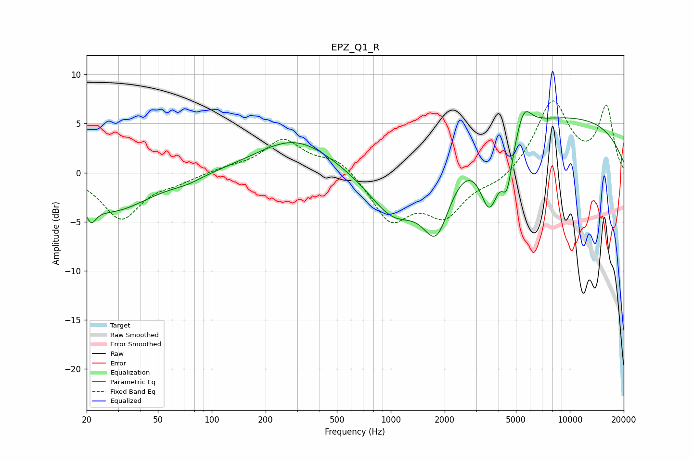

# EPZ_Q1_R
See [usage instructions](https://github.com/jaakkopasanen/AutoEq#usage) for more options and info.

### Parametric EQs
Apply preamp of -6.3 dB when using parametric equalizer.

|   # | Type    |   Fc (Hz) |    Q |   Gain (dB) |
|-----|---------|-----------|------|-------------|
|   1 | Peaking |        21 | 5.26 |        -1.6 |
|   2 | Peaking |        27 | 0.65 |        -3.9 |
|   3 | Peaking |        73 | 1.64 |        -0.5 |
|   4 | Peaking |       292 | 0.66 |         3.5 |
|   5 | Peaking |      1049 | 0.94 |        -5.6 |
|   6 | Peaking |      1801 | 1.74 |        -7.2 |
|   7 | Peaking |      3560 | 2.56 |        -6.8 |
|   8 | Peaking |      4464 | 4.63 |        -4.4 |
|   9 | Peaking |      5545 | 3.43 |         2.4 |
|  10 | Peaking |      7299 | 0.18 |         5.9 |

### Fixed Band EQs
When using fixed band (also called graphic) equalizer, apply preamp of **-7.4 dB** (if available) and set gains manually with these parameters.

|   # | Type    |   Fc (Hz) |    Q |   Gain (dB) |
|-----|---------|-----------|------|-------------|
|   1 | Peaking |        31 | 1.41 |        -4.6 |
|   2 | Peaking |        62 | 1.41 |        -0.8 |
|   3 | Peaking |       125 | 1.41 |         0.4 |
|   4 | Peaking |       250 | 1.41 |         3.3 |
|   5 | Peaking |       500 | 1.41 |         1.5 |
|   6 | Peaking |      1000 | 1.41 |        -4.7 |
|   7 | Peaking |      2000 | 1.41 |        -4   |
|   8 | Peaking |      4000 | 1.41 |        -1.1 |
|   9 | Peaking |      8000 | 1.41 |         7.2 |
|  10 | Peaking |     16000 | 1.41 |         6.5 |

### Graphs

