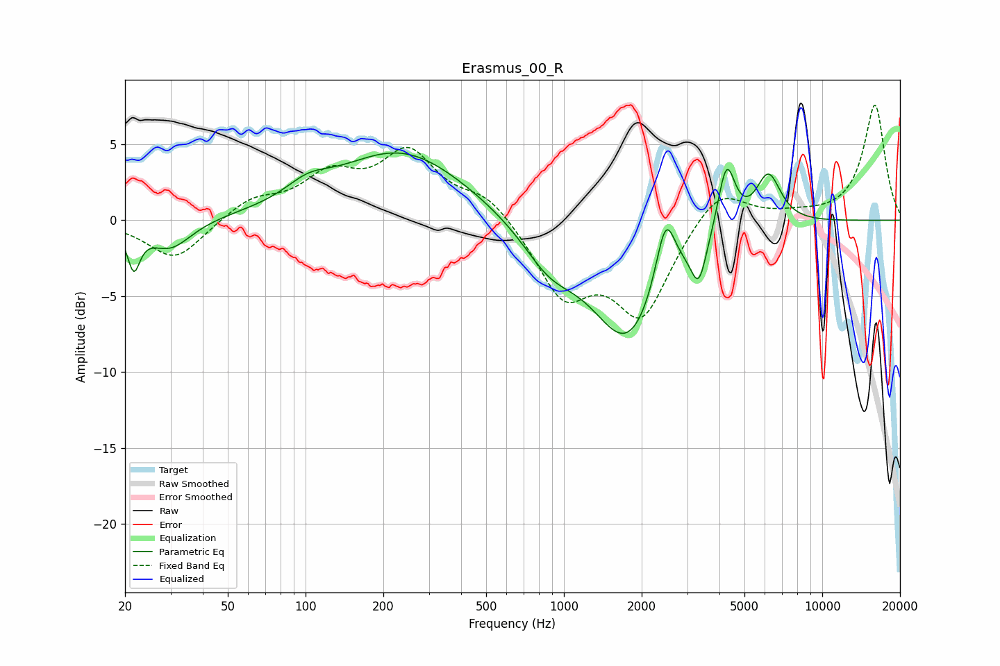

# Erasmus_00_R
See [usage instructions](https://github.com/jaakkopasanen/AutoEq#usage) for more options and info.

### Parametric EQs
Apply preamp of -4.5 dB when using parametric equalizer.

|   # | Type    |   Fc (Hz) |    Q |   Gain (dB) |
|-----|---------|-----------|------|-------------|
|   1 | Peaking |        22 | 5.98 |        -2.7 |
|   2 | Peaking |        30 | 1.72 |        -1.9 |
|   3 | Peaking |       102 | 1.69 |         1   |
|   4 | Peaking |       235 | 0.56 |         4.6 |
|   5 | Peaking |       877 | 1.35 |        -2.3 |
|   6 | Peaking |      1771 | 0.98 |        -7.9 |
|   7 | Peaking |      2473 | 3.62 |         4.7 |
|   8 | Peaking |      3328 | 4.73 |        -2.8 |
|   9 | Peaking |      4259 | 4.09 |         4.6 |
|  10 | Peaking |      6185 | 2.82 |         3.4 |

### Fixed Band EQs
When using fixed band (also called graphic) equalizer, apply preamp of **-7.7 dB** (if available) and set gains manually with these parameters.

|   # | Type    |   Fc (Hz) |    Q |   Gain (dB) |
|-----|---------|-----------|------|-------------|
|   1 | Peaking |        31 | 1.41 |        -2.7 |
|   2 | Peaking |        62 | 1.41 |         1.3 |
|   3 | Peaking |       125 | 1.41 |         2.6 |
|   4 | Peaking |       250 | 1.41 |         4.2 |
|   5 | Peaking |       500 | 1.41 |         1.6 |
|   6 | Peaking |      1000 | 1.41 |        -4.7 |
|   7 | Peaking |      2000 | 1.41 |        -6   |
|   8 | Peaking |      4000 | 1.41 |         2.4 |
|   9 | Peaking |      8000 | 1.41 |         0.3 |
|  10 | Peaking |     16000 | 1.41 |         7.6 |

### Graphs

