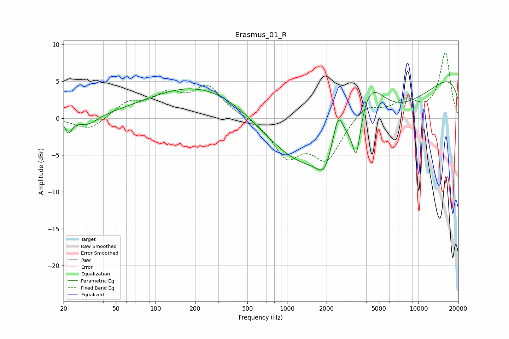

# Erasmus_01_R
See [usage instructions](https://github.com/jaakkopasanen/AutoEq#usage) for more options and info.

### Parametric EQs
Apply preamp of -5.0 dB when using parametric equalizer.

|   # | Type    |   Fc (Hz) |    Q |   Gain (dB) |
|-----|---------|-----------|------|-------------|
|   1 | Peaking |        22 | 5.71 |        -1.8 |
|   2 | Peaking |        30 | 1.81 |        -1.3 |
|   3 | Peaking |       316 | 0.28 |         5.7 |
|   4 | Peaking |      1603 | 0.37 |        -4.2 |
|   5 | Peaking |      1912 | 2.84 |        -2.2 |
|   6 | Peaking |      2449 | 3.49 |         4.8 |
|   7 | Peaking |      3066 | 0.18 |        -8   |
|   8 | Peaking |      3373 | 4.64 |        -5.7 |
|   9 | Peaking |      4259 | 1.22 |         7   |
|  10 | Peaking |     10000 | 0.18 |         8.1 |

### Fixed Band EQs
When using fixed band (also called graphic) equalizer, apply preamp of **-9.0 dB** (if available) and set gains manually with these parameters.

|   # | Type    |   Fc (Hz) |    Q |   Gain (dB) |
|-----|---------|-----------|------|-------------|
|   1 | Peaking |        31 | 1.41 |        -1.7 |
|   2 | Peaking |        62 | 1.41 |         2   |
|   3 | Peaking |       125 | 1.41 |         2.8 |
|   4 | Peaking |       250 | 1.41 |         4.1 |
|   5 | Peaking |       500 | 1.41 |         0.2 |
|   6 | Peaking |      1000 | 1.41 |        -4.9 |
|   7 | Peaking |      2000 | 1.41 |        -5.3 |
|   8 | Peaking |      4000 | 1.41 |         1.9 |
|   9 | Peaking |      8000 | 1.41 |         2.2 |
|  10 | Peaking |     16000 | 1.41 |         8.9 |

### Graphs

